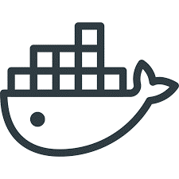

## In this session

In this sessions, you:

* Prepare to install RStudio Connect
    - Pre-requisites
    - Design decisions
* Download and install Connect


## The mental model of Connect


### Climbing a Mountain vs Cimbing a Tree


Getting from A to B isn't going to be like climbing a mountain, it's  like climbing a tree (picking which fork to follow amongst numerous branches).


### Finding Information

Refer to the product documentation at:

* [https://docs.rstudio.com/](https://docs.rstudio.com/)
* [https://docs.rstudio.com/connect/admin](https://docs.rstudio.com/connect/admin)


This course is about teaching you to fish, not giving fish.

* Open up the guide, this will be a resource throughout the course and will help you decide which branch to pick.


## Installation requirements


### Installing Connect - Where? 





Support article: [Configuration and sizing recommendations](https://support.rstudio.com/hc/en-us/articles/115002344588-Configuration-and-sizing-recommendations)


### Installing Connect - Where? 

Typical questions

* How big a server?
    * It all depends on what your content will be doing in R.
    * It is best to learn over time and crawl-walk-run where possible.
    * The support article [Configuration and sizing recommendations](https://support.rstudio.com/hc/en-us/articles/115002344588-Configuration-and-sizing-recommendations) provides some suggestions.

* Docker?
    * Connect is designed to run on a persistent server, think SharePoint.
    * As you will see, it internally runs and isolates user submitted code, manages processes, sandboxes permissions, etc.
    * You will get into this more, but all these aspects make it a bit of an odd fit for Docker. That said, it's possible, but must be run in a [privileged container](https://docs.docker.com/engine/reference/run/#runtime-privilege-and-linux-capabilities).
    * Running in a privileged container may reduce the amount of process isolation that Docker offers. Whether it is still worth dockerizing is a choice you must make.

* What operating system?
    * Connect is supported on RHEL, Ubuntu and SUSE
    * Refer to [Requirements for RStudio Connect](https://docs.rstudio.com/rsc/requirements/)
    * For data science work we recommend Ubuntu


### Installing Connect - How?


Installation of RStudio Connect requires root permissions.

* (We will explain why later.)
* **TL;DR:** Requirement comes from a strict security viewpoint.


## System requirements


### System requirement: R

Where can R be installed?

[https://docs.rstudio.com/connect/admin/r](https://docs.rstudio.com/connect/admin/r)

```sh
which R

Rscript -e 'R.home()'
```

Notice that neither path includes a version.


### System requirement: Build R from pre-compiled binaries


RStudio Connect is all about "deploy and forget". This means you don't want existing content to break when R is upgraded.

To achieve this, RStudio Connect supports **multiple versions of R**. 

### Recommended best practice:

* Install R from [pre-compiled binaries](https://docs.rstudio.com/resources/install-r/)
* Store in version specific locations, for example:

  - `/opt/R/3.5.0`
  - `/opt/R/3.6.0`
  - `/opt/R/3.6.1`
    


### Upgrading R

Because Connect supports multiple versions of R, the upgrading decision is easy:

Upgrading R is as simple as installing another version of R side-by-side.

* Again, be sure to [install R from pre-compiled binaries](https://docs.rstudio.com/resources/install-r/)!

Important: avoid upgrading by using your repository:

* Avoid `apt-get upgrade` !!!
* Avoid `yum upgrade` !!!


## Installing Connect


### Installing Connect: server sizing?

Q: What type of server should Connect run on? (Memory, CPU, etc).

A: It depends. You should be able to answer this question by the end of the course.

* [General guidelines here](https://support.rstudio.com/hc/en-us/articles/115002344588-Configuration-and-sizing-recommendations)
* It all depends on what your content will be doing in R.
    - Best to learn over time and crawl-walk-run where possible.


### Installing Connect: Docker?

Q: Can I use Connect in a Docker container?

A: Possible but not recommended. 


* RSC is designed to run on a persistent server (think SharePoint).
* As you'll see, it internally runs and isolates user submitted code, manages processes, sandboxes permissions, etc.
* All these aspects make it a bit of an odd fit for Docker.
* That said, it's possible, but will require a [privileged container](https://docs.docker.com/engine/reference/run/#runtime-privilege-and-linux-capabilities). This means some of the process isolation offered by docker will not be available.


### Downloading Connect

Download page links to current version:

[https://docs.rstudio.com/rsc/installation/](https://docs.rstudio.com/rsc/installation/)


### Screencast: download and install Connect


<asciinema-player src="../../asciicast/install_connect.cast"></asciinema-player>


## Your turn


### Your turn


Next complete the exercise.

Signs of success:

* The connect log indicates that Connect is listening on port 3939
* You successfully get the Connect landing page
  
