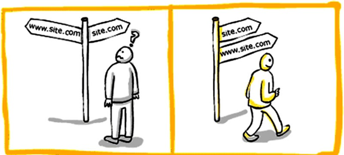
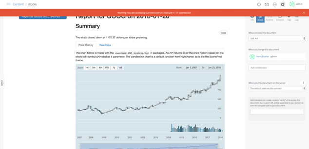
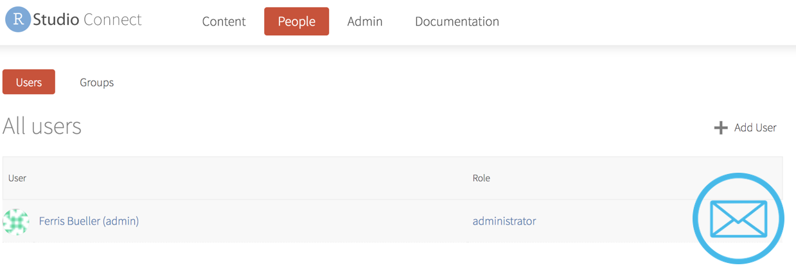
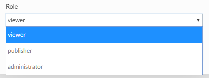

## In this session

In this session you:

* Make more choices about Connect configuration
* Edit the configuration file for essential setup
* Activate a license using the RStudio Floating License manager


## Configuration


### Configuration

In this chapter you will learn how to make choices to configure RStudio Connect.

```gcfg
; RStudio Connect configuration file

[Server]
; SenderEmail = account@company.com
SenderEmail =

; Address is a public URL for this RStudio Connect server. Must be configured
; to enable features like including links to your content in emails. If
; Connect is deployed behind an HTTP proxy, this should be the URL for Connect
; in terms of that proxy.
;
; Address = https://rstudio-connect.company.com
Address =

[HTTP]
; RStudio Connect will listen on this network address for HTTP connections.
Listen = :3939

[Authentication]
; Specifies the type of user authentication.
Provider = LDAP
```


### Initial configuration


The configuration file is at: `/etc/rstudio-connect/rstudio-connect.gcfg`

It has the Go Configuration File (`.gcfg`) format:

```gcfg
[Section Heading]
Field = Value  
```

For initial setup, you must set two fields in the `Server` section:

* Server address
* Sender email

```gcfg
[Server] 
Address = ...
SenderEmail = ...
```


### Server Address

```gcfg
[Server] 
Address
```




The server address implies many choices:

* Proxies
* http(s) and browser security
* Load balancing


* This field is the address your end users will enter to get to your RSC instance.
* Implies a lot of choices.
    - Proxy?
    - http(s) > Browser Security
    - Load Balancing … Later

For now, you need the name of the training server (that you got earlier in the course)


###  Server SenderEmail

```gcfg
[Server] 
SenderEmail
```


This is the "From" address, i.e. the email address that Connect uses to send email.

This field does not complete email setup!

* You must also configure a mail server, using either:

    * [sendmail](https://en.wikipedia.org/wiki/Sendmail)
    * [SMTP](https://en.wikipedia.org/wiki/Simple_Mail_Transfer_Protocol)
    
* Your organisation will already have a an email gateway, and you should use this on your Connect instances.

* Later in this course, during the exercises, you will use SMTP to send email.


### http NoWarning 

```gcfg
[http]
NoWarning
```

(For your sanity during the course. Do not do this in production!)




### Configuration

Connect admin guide [Appendix A: Configuration Options](https://docs.rstudio.com/connect/admin/appendix/configuration/#Server)

One way to teach this class would be to go through each of the configuration settings. 

* We are not going to do that.
* We are going to focus on using RStudio Connect and hit the options as we go.

**We will not cover ALL of the options.**

Homework:

* Read through the rest of the config settings.
* Like the dentist: boring, important, and you should do it once a year.


### Starting and Stopping


Depends on operating system. See [Stopping and Starting](https://docs.rstudio.com/connect/admin/server-management/#stopping-starting) for complete instructions.


For the classroom VM using **Ubuntu**:

```bash
sudo systemctl stop rstudio-connect 
sudo systemctl start rstudio-connect
```

* Use for restart, but note that this causes downtime.
* In a production setting, if you already have running processes on your Connect server, you can use `reload` instead, since this picks up some configuration changes:


```bash
sudo systemctl reload rstudio-connect
```

Note:

* only system settings flagged with `Reloadable: true` will be affected if you use `reload` instead of `restart`.
* See the [admin guide appendix](https://docs.rstudio.com/connect/admin/appendix/configuration/#reloadable-properties).


### Server Logs 

A few types of logs:

* Server log
* Access log
* Application logs (deployed content)

```bash
ls /var/log/rstudio-connect.*
sudo tail /var/log/rstudio-connect.log 
```

Run the commands and discuss the log output


### Licensing

* Online: servers can activate automatically
* Offline: licenses require manual exchange.


### Licensing: online and offline

**Online** servers automatically start with a 45 day trial.

License can be activated with: 

```bash
sudo /opt/rstudio-connect/bin/license-manager activate KEY
```

**Offline** servers require  a 3 step activation for both trials and full licenses.

* Step 1: Run a command to generate an XML file.
* Step 2: Use the XML file to generate a key.
* Step 3: Activate the license with the key.

[http://apps.rstudio.com/offline-activation/](http://apps.rstudio.com/offline-activation/)


### Licensing: floating

In special circumstances, there is an alternative licensing mechanism called **floating licenses**.

Some use cases for floating licensing:

* You have multiple server installations to manage
* Some of these are transient / fleeting
* You have transient servers, e.g. staging server
* You manage a rotating blue/green production server setup


Download: [https://www.rstudio.com/floating-license-servers/](https://www.rstudio.com/floating-license-servers/)

Chapter 3.7 of the Connect admin guide discusses [Floating Licenses](https://docs.rstudio.com/connect/admin/licensing/#floating-licenses)


### It's Alive! Can I use it?

Not yet. More choices to make:

* Initial Configuration
* Auth Provider


## User Management and Authentication


### User Management and Authentication

Three parts:

Nr     | Part            | Description
-----  | --------------  | -----------------------
1.     | Authentication  | Who can access RStudio Connect?
2.     | User Role       | What can a user do on RStudio Connect?
3.     | ACL             | What can a user do to a piece of content on RStudio Connect


### Part 1: Authentication

Who can access RStudio Connect? (Authentication) 


Irrevocable choice, but an easy choice.


### Authentication

To answer **who** can access RStudio Connect, you must first tell Connect **where** users are defined.


My user information lives | Then 
------------------------- | -----
Nowhere. I thought Connect would handle users? | Use password auth and manage users in Connect. 
Active Directory  | Configure Connect to get user information via LDAP. 
Active Directory AND I need to pass user credentials through Connect to a backend | Connect will rely on local Unix accounts via PAM. Each user will need a local account. 
Google | Configure Connect to get user information from Google OAuth2. 
Azure AD, Okta, OneLogin, other SAML | Configure Connect with SAML
Somewhere else | Going to need proxied auth. 


### LDAP 

In this class you will integrate RStudio Connect with the LDAP server on the leader instance for this classroom.

This is similar to what you will do most likely do in your organization, if LDAP or Active Directory is used. However, the details in your organization will be different. Be sure to get in contact with the respective IT team and refer to the [LDAP section in the admin guide](https://docs.rstudio.com/connect/admin/authentication.html#authentication-ldap).

Hint, use the [following setting](https://docs.rstudio.com/connect/admin/authentication/ldap/#ldap-or-ad-configuration-settings) to get more descriptive messages in your log file.

```gcfg
[Debug]
Log = ldap
```


### Other Users?

Password Auth




Now that you're logged in, what about other users?

* For password auth an admin can register a user. But where does the password come from? Email setup.   
* For LDAP:
    - Users must self-register (but you can limit who can self register via the `PermittedLoginGroup` setting:

```
[LDAP]
PermittedLoginGroup
```


!!! note "Using the email print provider"
    A secret trick

    * Connect sends email for lots of things, and it is important to configure.
    * In some exceptional circumstances you may want to use a secret trick:

    **Do not use this for this class**

    ```gcfg
    [Server] 
    EmailProvider = print 
    ```

    This prints all email to the log file, bypassing `sendmail` or `SMTP`

    ```bash
    sudo tail /var/log/rstudio-connect.log   
    ```

    Some of our partners use this for automated configuration testing.


### Other Users - LDAP?

For LDAP authentication:

* Users must self-register
* but you can limit who can self register by using:

```gcfg
[LDAP]
PermittedLoginGroup
```


### Other Users - Other Providers?


```
{r, echo=FALSE}
dat <- read.csv("files/02_server_management/02_02_authentication_providers.csv", header = TRUE, check.names = FALSE)
dat %>% 
  gt(rowname_col = "Attribute") %>% 
  tab_spanner(label = "Auth provider", columns = everything())
```

!!! note "Question"
    Where does information come from?


### Authentication - Other Methods


PAM Authentication

* Configuration is limited in Connect, extensive in PAM. 
* Copy the `ssh` login PAM profile. 


Proxied Authentication

* Set up a proxy (e.g. using `nginx` or `Apache`) in front of Connect to handle all user auth.
* The proxy passes a secure header to tell Connect who the user is.    


### Authentication - Groups

Connect supports groups, but only for some authentication schemas:

* **LDAP** groups will automatically be identified and can be used for access control.
* For **Password auth**, groups can be created and managed by admins.
* But note that **proxied auth does not support groups**.


## User roles


### User Roles

* What can a user do on RStudio Connect? (User Role) 
* What can a user do to a piece of content on RStudio Connect? (ACL) 


Connect allows 4 different types of user roles:

* Administrator
* Publisher
* Viewer
* Anonymous


[https://docs.rstudio.com/connect/admin/user-management/#user-roles](https://docs.rstudio.com/connect/admin/user-management/#user-roles)


### Configuration of user roles


* Option 1:  Admin can set default user roles
    * Specifies what abilities given to a newly created user. Allowed values are publisher or viewer
  
```gcfg
[Authorization]
DefaultUserRole
```

* Option 2: Connect UI
    * Admin can change user role in the Connect UI
  



* Option 3: Command line interface (CLI)
    * [Connect Admin Guide: CLI](https://docs.rstudio.com/connect/admin/appendix/cli/#usermanager)


* Remember the mental model - option 1 is another choice between branches.
* Show an example of changing the user role in the UI.
* Pull up the CLI and run the `--help` command just so they can see the options. (Used for bulk changes).


## Other advanced topics


### Security Best Practices 

Connect admin guide:

* [Security & Auditing](https://docs.rstudio.com/connect/admin/security-and-auditing/)
* [Browser security](https://docs.rstudio.com/connect/admin/security-and-auditing/#browser-security)

Highlights:

1. SSL and friends (secure cookies enabled, CORS, click-jacking) 
2. Session timeouts 
3. Captcha

This is covered in the [Browser security](https://docs.rstudio.com/connect/admin/security-and-auditing/#browser-security) section of the Connect admin guide.

What about data governance? Later in the course you will become familiar with sandboxing in Connect.


???

The last line is about reassurance, RStudio has done many security audits internally and with big name customers.


### Upgrading Connect

Same process as the initial installation.

1. Download the new binary.
2. Install the new binary on top of the existing installation.
    - Will restart the service.


### Load balancing / High availability 


Only 3 changes to your setup.  

1.  Shared Storage 
2.  Postgres DB
3.  Sticky load balancer 


Connect Admin Guide: [High Availability and Load Balancing](https://docs.rstudio.com/connect/admin/load-balancing/)


## Summary


### Summary

In this chapter you learned about some of the decision points when configuring a Connect instance.

The exercises will guide you through these steps for one specific branch:

* LDAP auth
* floating license manager
* single instance

In subsequent chapters you will start using RStudio Connect and deploying content to your machine.


## Your turn


### Your turn

Next complete the exercise.

Signs of success:

    * You have a running instance of RStudio Connect
    * You have working email integration
    * You have multiple users, and you can log in using their LDAP credentials
