## In this session

In this session you:

* Connect your RStudio IDE to Connect
* Deploy a simple app
* Discover some other administrator tools

---

## Connecting the IDE

---


### Connecting your IDE to Connect

To deploy content from the IDE to Connect, you first have to set up a connection, i.e. tell the IDE where to find Connect.


`RStudio --> Tools  --> Global Options --> Publishing --> Connect`


Enter your server address: 'http://<host_name>/rsconnect'

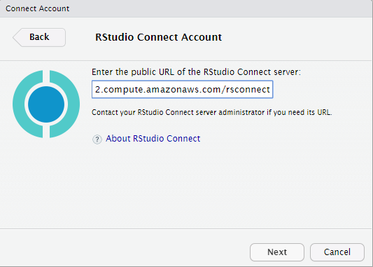


???

Have them do this now. Talk about what happens and show them the resulting file.


---


### Video: Connecting your IDE to Connect

<video width="100%" controls>
  <source src="https://cdn.rstudio.com/pro-admin/videos/connect_ide_to_connect.mp4" type="video/mp4">
</video>


---

### Pointing IDE to Connect

What does this do?

* Creates a public / private key pair and stores the key (and token) in a user-specific folder. 		

Why do this?

* When you publish content you have a machine talking to another machine.
* That means you need a non-interactive way to authenticate.
* HINT: This theme will come up again


???

Run the following as a demo:

```r
## R
## creates a directory
rsconnect::accountsConfigDir()
```

```sh
## sh
## shows a few .dcf files
tree <directory>
cat <result.dcf> 
```


---

### Demo

Deploy an app to Connect

* Navigate to `0_app` and open `app_0.R`
* Select "Run App"
* In the upper-right hand corner, "Publish"

???

* Observe how long it takes


---

### That was pretty easy ...

... make a trivial change in the app and deploy again.

Write down your observations.

???

* Much faster
* App failed 


---

## Understanding failure


---

### Understanding failure

Deploying content to Connect is like taking a kid from home to daycare.


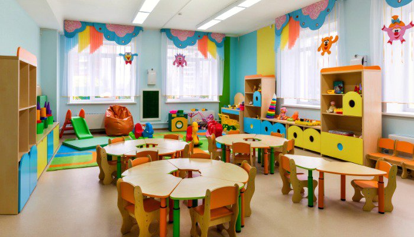


* If a problem arises, you must troubleshoot
    - Did the problem happen at home (you forgot it)?
    - Or at daycare (they lost it)?
* There also are different rules at home and daycare.


---

### Explore some troubleshooting tools

* Deployment Log
* Bundles
* Application Log
* Connect Sandbox 


---

### Deployment log

```sh
Preparing to deploy application...DONE
Uploading bundle for application: 1...DONE
Deploying bundle: 1 for application: 1 ...
Building Shiny application...
Bundle requested R version 3.4.1; using /usr/lib64/R/bin/R which has version 3.4.1 
2017/12/05 00:15:36.162805962 # Validating R library read / write permissions ------------
2017/12/05 00:15:36.188861769 # Validating packrat installation --------------------------
2017/12/05 00:15:36.189041620 Installed packrat SHA is: 29b1c491b8f90aab40077d011d0077d81a99d7d4 
2017/12/05 00:15:36.189180324 Packaged packrat SHA is:  29b1c491b8f90aab40077d011d0077d81a99d7d4 
2017/12/05 00:15:36.190624677 Packrat is up-to-date. 
2017/12/05 00:15:36.190776099 R version: 3.4.1
2017/12/05 00:15:36.190838996 packrat version: 0.4.8.43
2017/12/05 00:15:36.191408200 # Validating packrat cache read / write permissions --------
2017/12/05 00:15:36.307287524 Audited package hashes with local packrat installation. 
2017/12/05 00:15:36.310763166 # Installing required R packages withpackrat::restore()` ---
2017/12/05 00:15:36.491569335 Installing BH (1.65.0-1) ...  
2017/12/05 00:15:43.453766543 Caching BH. 
2017/12/05 00:15:45.498690843 Using cached BH. 
2017/12/05 00:15:45.645180957 	OK (built source) 
2017/12/05 00:15:45.645525390 Installing MASS (7.3-47) ...  
2017/12/05 00:15:53.866638423 Caching MASS. 
2017/12/05 00:15:53.891269915 Using cached MASS. 
2017/12/05 00:15:53.892713176 	OK (built source) 
2017/12/05 00:15:53.892966963 Installing R6 (2.2.2) ...  
2017/12/05 00:15:55.248487715 Caching R6. 
2017/12/05 00:15:55.253542270 Using cached R6. 
2017/12/05 00:15:55.254496893 	OK (built source) 
2017/12/05 00:15:55.254752408 Installing RColorBrewer (1.1-2) ...  
2017/12/05 00:15:56.433528568 Caching RColorBrewer. 
2017/12/05 00:15:56.436468956 Using cached RColorBrewer.
2017/12/05 00:15:56.437064457 	OK (built source) 
2017/12/05 00:15:56.437335870 Installing Rcpp (0.12.13) ...
```


---

## The deployment bundle


---

### Components of the bundle

Part 1: Create Bundle on Client

Part 2: Upload Bundle on RSC

Part 3: Restore Bundle


---

### Components of the bundle: Create and upload

Part 1: Create Bundle on Client

```sh
Preparing to deploy application...DONE
```

Part 2: Upload Bundle on RSC

```sh
Uploading bundle for application: 1...DONE
Deploying bundle: 1 for application: 1 ...
```


---

### Components of the bundle: Restore

Part 3: Restore Bundle

```sh
Bundle requested R version 3.4.1; using /usr/lib64/R/bin/R which has version 3.4.1 
2017/12/05 00:15:36.162805962 # Validating R library read / write permissions -------------------------------- 
2017/12/05 00:15:36.188861769 # Validating packrat installation ----------------------------------------------
2017/12/05 00:15:36.189041620 Installed packrat SHA is: 29b1c491b8f90aab40077d011d0077d81a99d7d4 
2017/12/05 00:15:36.189180324 Packaged packrat SHA is:  29b1c491b8f90aab40077d011d0077d81a99d7d4 
2017/12/05 00:15:36.190624677 Packrat is up-to-date. 
2017/12/05 00:15:36.190776099 R version: 3.4.1
2017/12/05 00:15:36.190838996 packrat version: 0.4.8.43
2017/12/05 00:15:36.191408200 # Validating packrat cache read / write permissions ----------------------------
2017/12/05 00:15:36.307287524 Audited package hashes with local packrat installation. 
2017/12/05 00:15:36.310763166 # Installing required R packages withpackrat::restore()` ---------------------
2017/12/05 00:15:36.491569335 Installing BH (1.65.0-1) ...  
2017/12/05 00:15:43.453766543 Caching BH. 
2017/12/05 00:15:45.498690843 Using cached BH. 
2017/12/05 00:15:45.645180957 	OK (built source) 
2017/12/05 00:15:45.645525390 Installing MASS (7.3-47) ...  
2017/12/05 00:15:53.866638423 Caching MASS. 
2017/12/05 00:15:53.891269915 Using cached MASS. 
2017/12/05 00:15:53.892713176 	OK (built source) 
2017/12/05 00:15:53.892966963 Installing R6 (2.2.2) ...  
2017/12/05 00:15:55.248487715 Caching R6. 
2017/12/05 00:15:55.253542270 Using cached R6. 
2017/12/05 00:15:55.254496893 	OK (built source) 
2017/12/05 00:15:55.254752408 Installing RColorBrewer (1.1-2) ...  
2017/12/05 00:15:56.433528568 Caching RColorBrewer. 
2017/12/05 00:15:56.436468956 Using cached RColorBrewer.
2017/12/05 00:15:56.437064457 	OK (built source) 
2017/12/05 00:15:56.437335870 Installing Rcpp (0.12.13) ...
```

---

### Summary of the bundle

Lots happened during the deployment.

First thing is the deployment log in the IDE: 

1. What is this bundle thing?

2. Application and bundle Id

3. Version of R requested vs used

4. Packages to install


---

### Bundle: bundle id and app id

The `bundle id` and `app id` contain useful information. 

This is the log for a deployment to an app with  **app id** `2`. Notice the **bundle id** is `5`:

```sh
Discovering document dependencies... OK
Preparing to deploy document...DONE
Uploading bundle for document: 2...DONE
Deploying bundle: 5 for document: 2 ...
Building R Markdown document...
```

The app id (2) corresponds to the app id in Connect (2):


---

### Redeployment increments the bundle id

Redeploying the app increments the bundle id (in this case to 6).

* (The bundle id is unique across the Connect instance)

```sh
Discovering document dependencies... OK
Preparing to deploy document...DONE
Uploading bundle for document: 2...DONE
Deploying bundle: 6 for document: 2 ...
Building R Markdown document...
```


---

### Video: viewing the bundle in Connect

<video width="100%" controls>
  <source src="https://cdn.rstudio.com/pro-admin/videos/connect_view_bundle.mp4" type="video/mp4">
</video>

---

### Viewing the bundle in Connect

You can download the bundle from Connect, and the bundle id corresponds to the information in the deployment log:

!!! note "Notice:"

    * Both bundles `2` and `6` appear in `Source Versions`
    * You can view, download or activate any previous bundle

    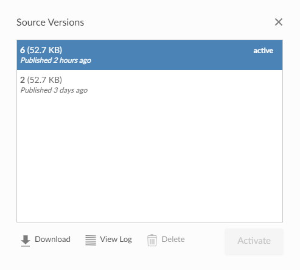


---

## Understanding what's in the bundle

---

### Part 1: Bundle (What are you sending to daycare?)

To understand what happened in RStudio, download the bundle from Connect. 

* Find the "Source versions" button by expanding the `...` pills button

* Then download the bundle


???

Download the bundle from RSC and show the contents of the `packrat.lock` file and the `manifest.json` file. Have them do this and discuss the results.


---

### Part 1:  Bundle (what's in the bundle?)

1. packrat.lock

  ```
  manifest.json
  PackratFormat: 1.4
  PackratVersion: 0.4.8.1 
  RVersion: 3.4.1
  Repos: CRAN=https://cran.rstudio.com/
  
  Package: BH 
  Source: CRAN 
  Version: 1.65.0-1 Hash: 95f62be4d6916aae14a310a8b56a6475
  ```

2. application code 

3. supporting files (data) 


---

### Part 1: Bundle (deployment record)

Deploying content creates a deployment record in the `rsconnect` folder.


```yml
name: admin_training_overview
title: Admin training: Overview
username: andrie
account: andrie
server: colorado.rstudio.com
hostUrl: https://colorado.rstudio.com:3939/__api__
appId: 1368
bundleId: 14449
url: https://colorado.rstudio.com:3939/admin_training_overview/
when: 1534319482.42767
```

Mostly used to help the IDE identify "re-deploying"


???

Show the contents of the rsconnect folder


---

### Part 2: Upload (How do you get to daycare?)

HTTP Requests


???

Discuss the pitfalls of custom SSL certs.


---

### Part 3: Restore (What happens at daycare?)

Unpacking the bundle --> installing the packages


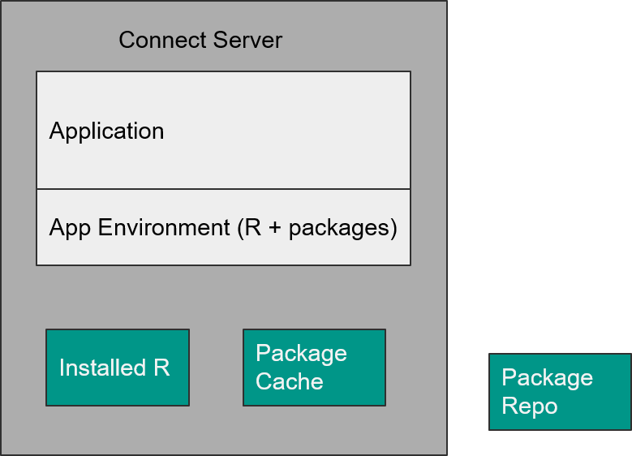

???

This slide is all about unpacking the bundle and installing packages.


---

### Where did the bundle go?

The internal architecture of RStudio Connect:

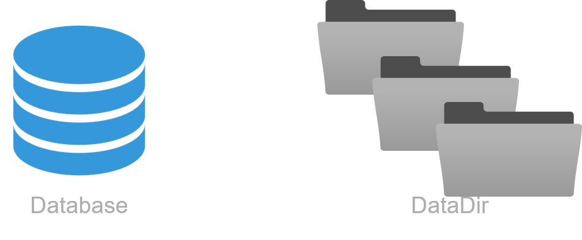


???

Talk about backups and migrations here? 

Have them navigate to `/var/lib/rstudio-connect` and run the `tree` command.


---

### Part 3: Restore (What happens at daycare?)

Connect installs packages from repositories.

* Each app has an isolated runtime environment, allowing apps to depend on different versions of packages.

App   |  Package version
:---: | ----------------
1     | `ggplot 0.8.0`
2     | `ggplot 0.1.0`


This is ok!

But it means Connect can't use a system library, because those can only have 1 version of a package.

???

Main takeaway, RSC has to be able to install the package:     

- Repo access (and what to do offline)
- System Libraries 


---

### Part 3: Restore

Most common sources of pain:

* Repository is not available
  - Solution: Set up an offline repository (RStudio Package Manager) 
  
* Package can not be installed (System Libraries) 
  - Solution: Add package to the system library.
  - Good news is the 80:20 rule applies.


???

Main takeaway, RSC has to be able to install the package:   
* Repo access (and what to do offline)
* System Libraries 


---

### Part 3: Restore (daycare rules are different)

RStudio Connect provides process management:

* [sandboxing](https://docs.rstudio.com/connect/admin/process-management/#sandboxing)
* isolation for apps with `tmp` [directory masking](https://docs.rstudio.com/connect/admin/process-management/#temp-directory)


---

## Sandboxing


---


### Sandboxing

The Connect admin guide on [sandboxing](https://docs.rstudio.com/connect/admin/process-management/#sandboxing):

> 'The RStudio Connect process runs as the root user. It needs escalated privileges to allow binding to protected ports and to create "unshare" environments that contain the R processes.'

This is why Connect needs to run as root!


---

### Sandboxing: packages

After uploading the bundle, Connect must be able to find and install all packages used by your app.

Typically Connect will look on CRAN and github for these packages.  However, if you use private packages in your app, you have several options:

* Create an internal, [private repository](https://docs.rstudio.com/connect/admin/r/package-management/#private-repositories)
* Use [external package installation](https://docs.rstudio.com/connect/admin/r/package-management/#external-package-installation)
    - a form of white listing (at your own risk...)
* Use RStudio Package Manager
    - You cover this in module 7 and 8 of this course


---

## "RunAs" User


---

### Understanding the "RunAs" user

Connect admins can change the `RunAs` user for any deployed app.

Possible values:

* Default rstudio-connect user
    - See [User Account for Processes](https://docs.rstudio.com/connect/admin/process-management/#runas)
* Local service account
* With PAM Authentication, the "logged-in" user
    - See [Current user execution](https://docs.rstudio.com/connect/admin/process-management/#runas) in the connect admin guide


---

## Redeployment

---

### Redeployment

Re-deployment of apps is substantially faster than the first deployment.

*  The reason is that Connect creates a cache of binary packages.
*  If a package (with matching version) has previously been instaled, then the installation simply retrieves the package from the cache.

Hint: You can see installation from cache in the deployment log


---

### Define "collaborator"

* Collaborate on application settings 
* Collaborate on code (co-publish)
    - Start by sharing the `rsconnect` folder


???

Show an example of publishing to content that someone else deployed (just so they can see what the IDE looks like)


---

## Content discoverability

---

### Content discoverability


---

### Content search by title

Connect allows you to search for content in several ways. The first is a simple search on content title.

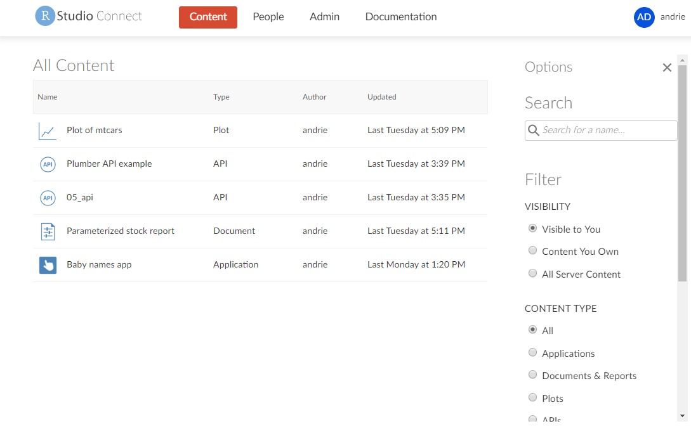


### Tag schema (taxonomy)

* The second way of searching for content on Connect is by using a taxonomy, or tag schema, of tags.


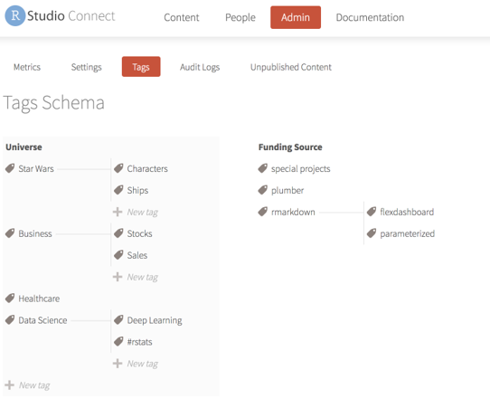


---

### Creating a tag schema

* The Connect administrator can:
    - view the "Tags" tab in the admin pane
    - create a custom schema
    - the is completely customizable by any Connect administrator


---

### Tags: tagging content

* Content **publishers** can tag their own content, using the schema that was pre-defined by the admin

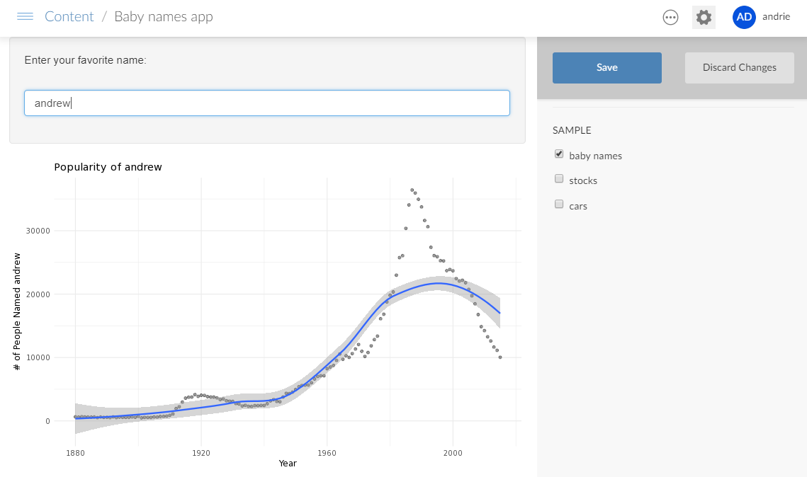

---

### Searching by tag

Content **viewers** can search content by tag.

* The normal access control rules apply, i.e. you can only see what you have access to.

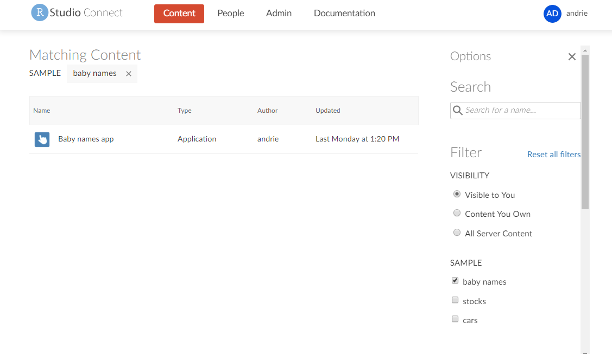

---

## Vanity URLs


---

### Vanity URLs

* Vanity URLS are useful to maintain a "static" URL even if you redeploy the content to a different Connect content ID.

* With [PublishersCanManageVanities](https://docs.rstudio.com/connect/admin/appendix/configuration/#Authorization.PublishersCanManageVanities) set to `true` administrators and publishers can create vanity URLs.

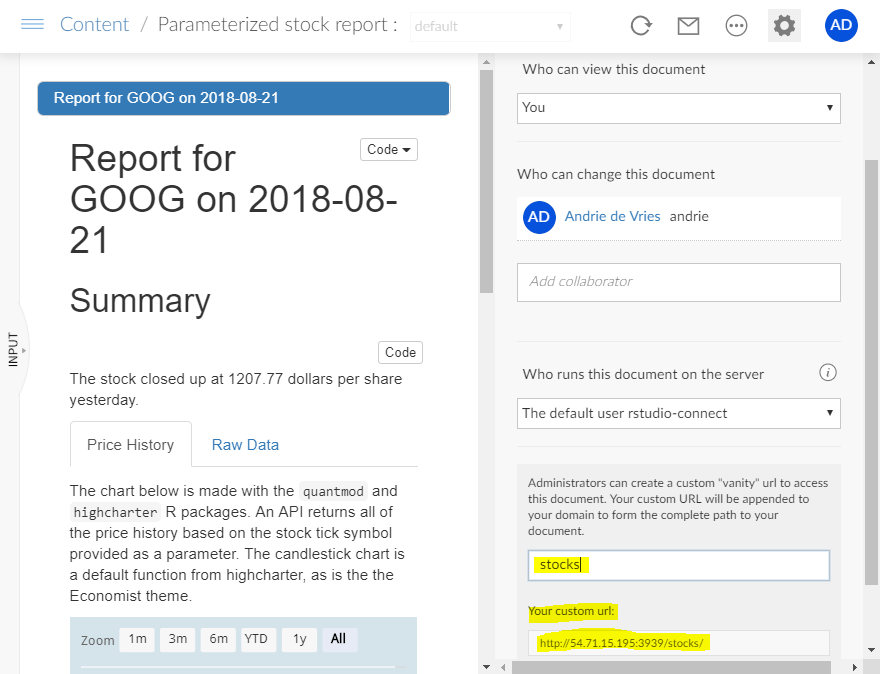
Creating a vanity URL


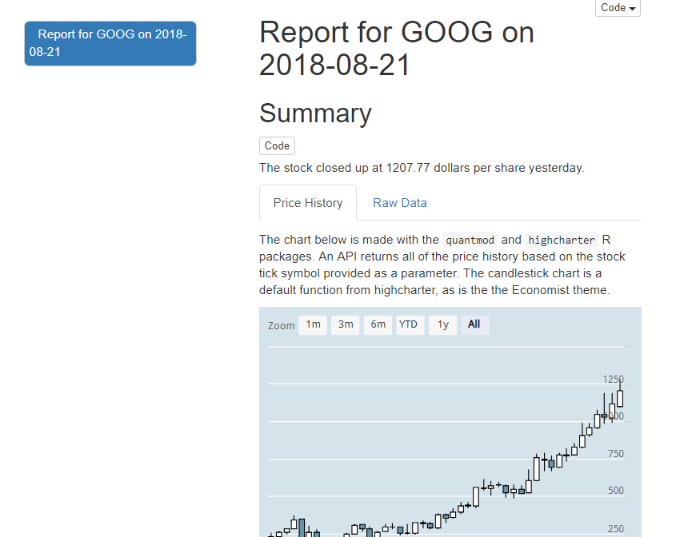
Viewing a vanity URL


---

## Other content deployment options


---

### Publishing apps with continuous Integration


* Authentication: machine to machine
  - Jenkins needs a key 
* Environment: Jenkins must create the bundle.
  - Implies Jenkins must replicate the dev environment 
* Testing: #2 sounds like a pain.
  - You can take advantage of your work for a very powerful side effect: Shiny unit testing ([`shinytest`](https://rstudio.github.io/shinytest/))

Other resources:
* https://solutions.rstudio.com/deploy/methods/
* https://github.com/slopp/rsc-ci-test
* https://docs.rstudio.com/connect/admin/appendix/ci/


---

### Publishing apps from git / github


You can also deploy artefacts to Connect directly from a git repository (including github)

Resources:

* https://solutions.rstudio.com/deploy/methods/#deploying-from-git-repositories

---

## Advanced admin topics

---

### Managing Connect in an offline environment

Need to set up a package repository that Connect can access:

Several ways to do this, including:

* `miniCRAN`
* `rsync`

**The recommended option:**

* [RStudio Package Manager](https://www.rstudio.com/products/package-manager/)


---

### Backup and migration

Backup:

* SQLite database is backed up automatically 
* Recommend snapshotting the entire Data Directory as well.

Migrations:

* A bit tricker because of all those installed packages that have been cached. 
* Follow the admin guide instructions.

---

## Your turn

---

### Your turn

Next complete the exercise.

Signs of success:

* You have connected your IDE to Connect
* You have published at least one app
* You understand how to read the deployment log and look for errors
