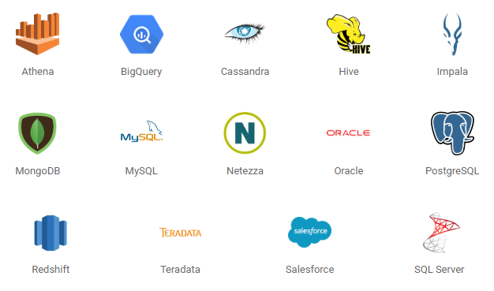
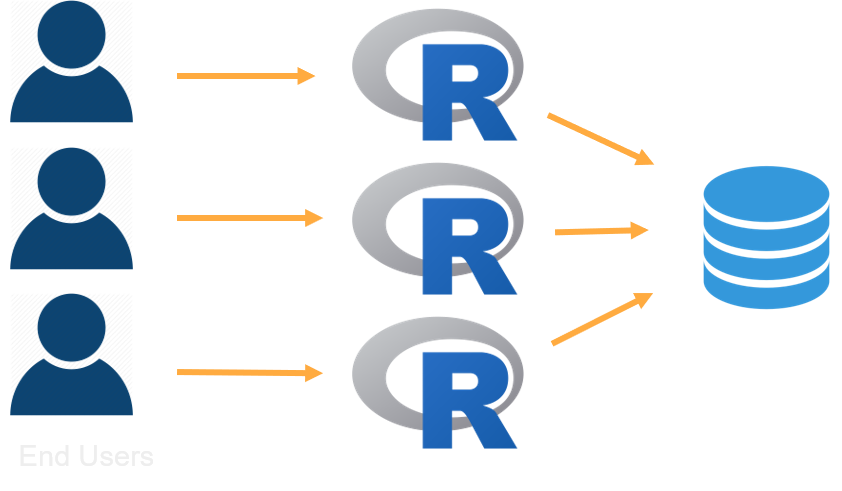
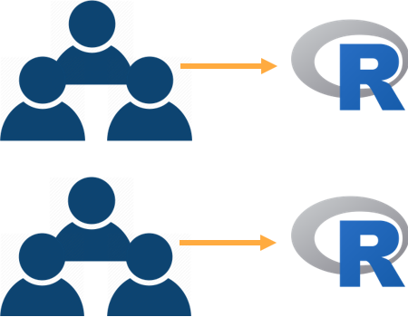
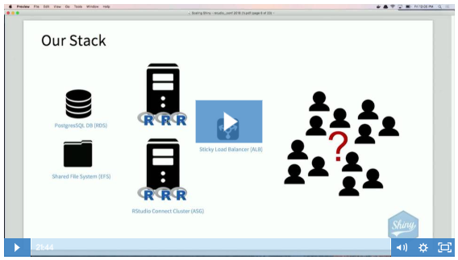

## In this session:

* Deploy a shiny app that connects to a database
* Understand considerations for connecting to data from a Shiny app
* Learn how to scale a Shiny App


---

## Accessing a database

---

### Connecting to a database

Most R applications will access external data, often from databases.

All of the RStudio best practise recommendations for working with databases is summarized at http://db.rstudio.com/


---

### Accessing Remote Data 

Content on Connect accesses data via R.  

This raises three primary concerns:

1. How to connect to data

2. How to secure data

3. How to deploy content that connects to data 


---

### Database connections


The database connection is defined in two files on your server:

| File         | Location          | Contains                                                              |
|--------------|-------------------|-----------------------------------------------------------------------|
| odbc.ini     | /etc/odbc.ini     | Data Source Name (DSN) information, containing the connection options |
| odbcinst.ini | /etc/odbcinst.ini | Contains the driver options                                           |


---

### Inside the odbc files

* The `odbc.ini` defines the connection string.  Notice the `driver` line:

```sh
sudo cat /etc/odbc.ini
```
    
```ini
[Postgres Dev]
driver = PostgreSQL
server = localhost
uid = ...
pwd = ...
port = 5432
database = postgres
```

* And observe how there is a matching `[PostgreSQL]` entry in the `odbcinst.ini` file:

```sh
sudo cat /etc/odbcinst.ini
```
  
```ini
[PostgreSQL]
Driver = /opt/rstudio-drivers/postgresql/bin/lib/libpostgresqlodbc_sb64.so
```


---

### The RStudio professional database drivers

RStudio provides a set of database drivers for use by customers with licenses for Pro products.

For more information:

* [Version 1.6.0 release blog post](https://blog.rstudio.com/2019/10/24/pro-drivers-1-6-0-release/)
* [Documentation](https://docs.rstudio.com/pro-drivers/)





---

## Data security

---

### Data security data at application level

Your first option (and most likely scenario) for securing data is at the **Application Level**

See [db.rstudio.com](http://db.rstudio.com), particulary the sections on [deployment](http://db.rstudio.com/best-practices/deployment/) and [managing credentials](http://db.rstudio.com/best-practices/managing-credentials/)

Pros:    

* cache data    
* wide audience

Cons: 

* responsibility on app developer  


---

### Data security data at data level

Your second option is to secure the data at the **Data Level**. This requires:

* PAM authentication, **AND**
* [RunAs](https://docs.rstudio.com/connect/admin/process-management/#runas) `LoggedIn` user

Again, see [db.rstudio.com](http://db.rstudio.com), particulary [deployment](http://db.rstudio.com/best-practices/deployment/) and [managing credentials](http://db.rstudio.com/best-practices/managing-credentials/)

Pros:

* Uses existing PAM access control list (ACL) and audit mechanisms

Cons:    

* narrower audience OR higher overhead
* harder to scale





!!! note "Note:
    Customers often use [kerberos](https://en.wikipedia.org/wiki/Kerberos_(protocol)) in this scenario


---

### Deploying

Consistency between **dev** and **prod** environments is **critical**! 

However, identical environments are not necessary.

[http://db.rstudio.com/best-practices/portable-code/](http://db.rstudio.com/best-practices/portable-code/) 


---

## Scaling shiny apps


---

### Scaling shiny apps

Now turn your attention to the second large topic: **Scaling** your Shiny apps.

Multiple users can connect to a single R process. 


**But R is single threaded...!**

???

Overview of the utilization scheduler.

Demo on the instructor server where and how to change the settings for an app.


---

### Video: Shiny app utilization scheduler

* Notice in this recording how the CPU indicator goes into the red very quickly, as each shiny connection puts a new demand on the database.
* However, even a 2 CPU machine can handle the 6 simultaneous connections, albeit with some delay to the user:


<video width="100%" controls>
  <source src="https://cdn.rstudio.com/pro-admin/videos/load_shiny_app.mp4" type="video/mp4">
</video>


---

### Scaling


The mental model for scaling shiny apps is a bit like chefs working in parallel in a kitchen.

Every chef can prepare an identical dish for a different customer, and the chefs don't interfere with one another. 

In this model:

* Chef: R process
* Guests: Client Connections
* Meal: Shiny App
* Kitchen: Server


---

### Multiple connections per R process in a Shiny app

How often does my code run?

* Global: once per R process  
* UI: once per client connection  
* Server: when client sends new inputs to the server    

```R
## Run once per R process
shared.data <- read.csv(...)

## Run once for every client connection
ui <- fluidPage(...)

## Run every time the client sends new input
server <- function(input, output){ 
  output$plot <- renderPlot({
    plot(input$num)      
  })
}
```

Support article: [Scaling and Performance Tuning in RStudio Connect](https://support.rstudio.com/hc/en-us/articles/231874748-Scaling-and-Performance-Tuning-in-RStudio-Connect)

???

Briefly discuss how multiple R users can even connect to 1 R process. How are things shared? When can there be contention? Shiny is stateful via the server's R session and the client (websocket communication) … different from other R code and other web frameworks BUT extremely powerful.

Tie in to databases: Mention the `pool` package and that the https://db.rstudio.com site has more info


---

### Multiple R processes




---

### Shiny runtime settings


RStudio Connect allows for multiple processes of a Shiny app, thus running multiple instances of the app in parallel.

The Connect admin guide explains these settings at:

* [Applications Plumber APIs](https://docs.rstudio.com/connect/admin/process-management/#applications-and-apis)
* [Runtime/Scheduler](https://docs.rstudio.com/connect/admin/appendix/configuration/#Scheduler)


---

### Conf::2018 video: "Scaling Shiny"




* Watch the video at [Scaling Shiny – Sean Lopp](https://resources.rstudio.com/shiny-2/scaling-shiny-sean-lopp?wvideo=mx214xmcqw) for a demo of **10,000 simultaneous connections**.

* Get the [shinyloadtest](https://github.com/rstudio/shinyloadtest) tools at github.


---

## Your turn

---

### Your turn


Next complete the exercise.

Signs of success:

* You modified the runtime settings to run a Shiny app in parallel
* You have a better intuition of the how to tune the runtime settings for different load scenarios
  
