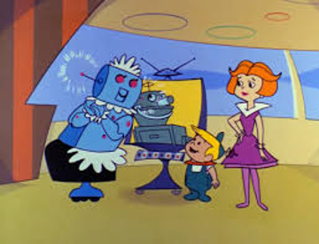
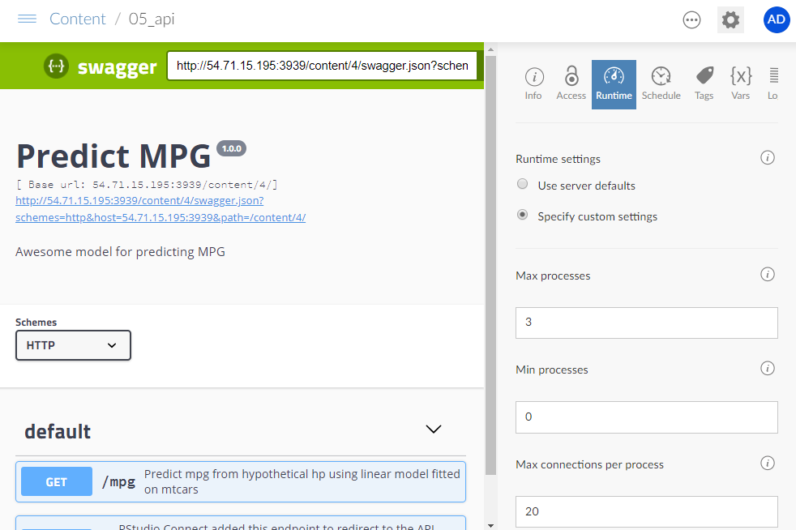

## In this session

In this sesssion you:

* Deploy an API to Connect


## Introducing APIs


### What is an API?

Human-to-machine communication


Machine-to-machine communication


### What is an API?

**Application programming interface**


From [Wikipedia](https://en.wikipedia.org/wiki/Application_programming_interface):

> "In computer programming, an application programming interface (API) is a set of subroutine definitions, communication protocols, and tools for building software. In general terms, it is a set of clearly defined methods of communication between various components"


A mechanism to:

* Send a request
* Receive a response
* Hide the implementation detail


### What is a REST API?

From [WikiPedia](https://en.wikipedia.org/wiki/Representational_state_transfer):

> Representational state transfer (**REST**) is a software architectural style that defines a set of constraints to be used for creating Web services.

> Web services that **conform to the REST architectural style**, called **RESTful Web services**, provide interoperability between computer systems on the Internet.

> RESTful Web services allow the requesting systems to access and manipulate textual representations of Web resources by using a uniform and predefined set of stateless operations.

In R, you can use the `plumber` package to turn an R function into REST API.


### Why APIs from R?


**Without Connect**

- Data science team generates insight. Insight results in a trained model 
- Model is tossed over the cubicle wall to IT team.
- 2 months later model is translated into Java from R
- Java model is extensively validated against original model 
- Java model is plugged into front-end and used for predictions. 
- Model needs to be updated. Repeat and recycle.

**>> Feedback cycle measured in months**


**With Connect**

- Data science team generates insight. Insight results in a trained model
- Users create API and deploy in a matter of days
- Front-end uses the same API calls for predictions

**>> Model is updated regularly**


## Hosting an API on Connect


### Articles about plumber APIs

* [Slack and Plumber, Part One](https://rviews.rstudio.com/2018/08/30/slack-and-plumber-part-one/)
* [Slack and Plumber, Part Two](https://rviews.rstudio.com/2018/11/27/slack-and-plumber-part-two/)
* [Plumber Logging](https://rviews.rstudio.com/2019/08/13/plumber-logging/)
* [REST APIs and Plumber](https://rviews.rstudio.com/2018/07/23/rest-apis-and-plumber/)


### Turning an R function into an API

The `plumber` package lets you create a REST API by merely decorating your existing R source code with special comments

[https://www.rplumber.io/docs/](https://www.rplumber.io/docs/)

```R
## Comment Decorators
#* @post /endpoint							
#* @param name:type description
function(name = default, req) {
  # deserialize json request
  # do R stuff
  # serialize result to json
}
```


### APIs on Connect

Connect supports the `plumber` package.  RStudio Connect automatically:

    * manages the dependent packages and files of your API
    * recreates an environment closely mimicking your local development environment on the server.
  
In other words, Connect deploys the same bundling strategy as for Shiny apps

In addition, Connect manages parallel processes:

* automatically manages the number of R processes necessary to handle the current load
* balances incoming traffic across all available processes
* It can also shut down idle processes when they’re not in use.

This allows you to run the appropriate number of R processes to scale your capacity to accommodate the current load.


### Running an API from the IDE


* When you click "Run API" in the RStudio IDE, the script will run and you will get a swagger documentation page.

<video width="100%" controls>
  <source src="https://cdn.rstudio.com/pro-admin/videos/run_plumber.mp4" type="video/mp4">
</video>


### Swagger documentation

When you test or deploy a plumber API, you get a [swagger](https://swagger.io/) documentation page.


From [WikiPedia](https://en.wikipedia.org/wiki/Swagger_(software))

> Swagger is an open-source software framework backed by a large ecosystem of tools that helps developers design, build, document, and consume RESTful web services.

> While most users identify Swagger by the Swagger UI tool, the Swagger toolset includes support for automated documentation, code generation, and test-case generation


### Deploying an API to Connect from the IDE


<video width="100%" controls>
  <source src="https://cdn.rstudio.com/pro-admin/videos/deploy_plumber.mp4" type="video/mp4">
</video>


### Deploy API 

You can also deploy an API programmatically using the `rsconnect` package.

```r
rsconnect::deployAPI(".", server = ..., account = ...)
```


## API authentication


### API authentication

When submitting an API request, the sender must authenticate with an API Key:

* API Keys are tied to users, not APIs
    - Service Accounts are OK
    - Treat them like passwords!
* Request Header:

```sh
Authorization: Key ABCDEFGHIJKLMNO
```


### Generating an API key on Connect

<video width="100%" controls>
  <source src="https://cdn.rstudio.com/pro-admin/videos/connect_api_key.mp4" type="video/mp4">
</video>


### Authenticated Request

* Restrict access to the sample API to your user.
* Set up an API key
* Make a request:

```sh
curl -X GET "<server_address>/mpg?new_hp=300" 
   -H  "accept: application/json"  -H "Authorization: Key <>" 
```


## Scaling APIs


### Scaling APIs

How do APIs scale?


* APIs are stateless... and they should do small amounts of work.
* So, back to the analogy, they are more like a bartender than a chef.
* (You still might want more than one in some cases, and prep work can still help).


### Connect runtime settings for APIs


To control the number of processes available to your API in Connect, use the Runtime settings.

* These settings are analogous to the runtime settings for Shiny apps.
* Refer to [Applications & APIs](https://docs.rstudio.com/connect/admin/process-management/#applications-and-apis) in the Connect Admin Guide





## Your turn


### Your turn


Next complete the exercise.

Signs of success:

* You have published an API to Connect
