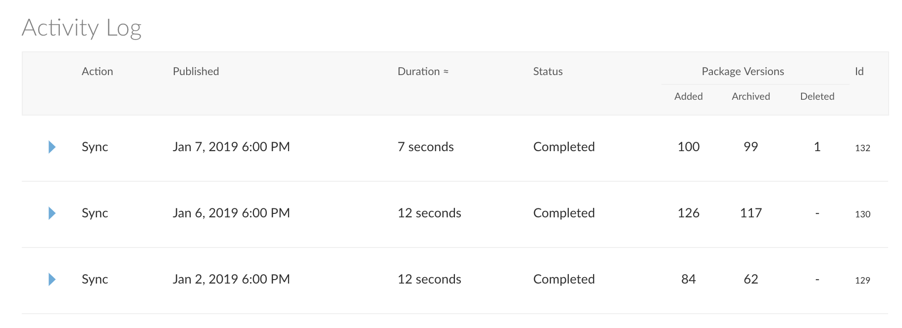

## Session overview

In this session, you will:

* Configure RSPM

* Use the RSPM command line interface (CLI)


---

## Course outline

Workflow for using RStudio Package Manager:

* Administrator installs RSPM on a server

* **Administrator performs configuration on RSPM server**

* Administrator creates sources and repositories

* End users connect to repositories and download packages

---

## In this module

* Configuration overview

* Administering RSPM via CLI

* Server management

* Maintaining RSPM

---

## Configuration overview

---

### Configuration options

Consider how your RSPM instance will function:

Configured via RSPM CLI:

* Initial CRAN metadata sync
* Package sources (CRAN, CRAN subset, Git, Local)
* Repositories (per your organizations needs)
* Download / update airgapped packages


Configured via RSPM configuration file:

* Lazy or eager package downloads
* Connectivity via HTTP/HTTPS
* Network ports
* Disk storage locations
* Database settings
* Security settings


---

### Configuration file

Contents of `/etc/rstudio-pm/rstudio-pm.gcfg`:

```gcfg
; RStudio Package Manager configuration file

[Server]
; Address is a public URL for this RStudio Package Manager server.
Address = https://rstudio-pm.company.com
;
; Git sources require a configured R installation
RVersion = /opt/R/3.5.1

[HTTP]
; RStudio Package Manager will listen on this network address for HTTP connections.
Listen = :80
```

All of the RSPM settings are documented in the Appendix on [Configuration Options](https://docs.rstudio.com/rspm/admin/appendix-configuration.html).

---

## Starting, stopping and restarting

---

### Starting, stopping and restarting

Occasionally it is necessary to start and stop the RStudio Package Manager
service.
Stopping and starting is handled by `systemd` or `Upstart`.


* For Ubuntu 16.04/18.04, RHEL/CentOS 7, SUSE 12:

  ```sh
  sudo systemctl stop rstudio-pm
  sudo systemctl start rstudio-pm
  ```

  or just:

  ```sh
  sudo systemctl restart rstudio-pm
  ```


After a restart, any scheduled syncs that were missed during downtime will
automatically begin. 

More details on stopping and starting RSPM are provided in the documentation on 
[Server Management - Stopping and Starting](https://docs.rstudio.com/rspm/admin/server-management.html#stopping-starting).


---

## Maintaining RSPM

---

### Upgrading

Upgrading RStudio Package Manager requires limited downtime.
During an upgrade users will not be able to install packages.
It is recommended that you perform upgrades during a period of downtime.

Steps for the upgrade process:

1. Download the latest installer
2. Run the install command

Upgrading does not affect packages or other variable data.

More details on upgrades are provided in the documentation on
[Server Management - Upgrading](https://docs.rstudio.com/rspm/admin/server-management.html#upgrading).

---

### Backing up

It is recommended that you back up the following locations:

Folder                | Contents
----------            | ----------------
`/var/lib/rstudio-pm` | Packages and variable data
`/etc/rstudio-pm`     | Configuration

A running RStudio Package Manager server may be writing into the data directory.
You should stop the RStudio Package Manager server before taking a backup.

If you have configured the databases to be stored outside the data directory,
ensure that it is also included in the backup and that it is performed at the
same time as the file backup.

More details on backups are provided in the documentation on
[Server Management - Backups](https://docs.rstudio.com/rspm/admin/server-management.html#backups).

---

### Logs


You can find logs at:

* Server logs: `/var/log/rstudio-pm.log`
* Access logs: `/var/log/rstudio-pm.access.log`

In addition, the activity log is available in the web interface:




Find more information in the RSPM admin guide:

* [Server Logs](https://docs.rstudio.com/rspm/admin/files-directories.html#server-log),
* [Access Logs](https://docs.rstudio.com/rspm/admin/files-directories.html#access-logs), and
* [Repository Versioning](https://docs.rstudio.com/rspm/admin/repositories.html#repo-versions).

---

### Licensing

View license status:

```sh
sudo /opt/rstudio-pm/bin/license-manager status
```

Activate license:

```sh
sudo /opt/rstudio-pm/bin/license-manager activate LICENSE_KEY
```

List of available commands:

```sh
sudo /opt/rstudio-pm/bin/license-manager
```

```sh
Supported commands: acquire-lease, acquire-lease-verbose, activate,
activate-offline, activate-offline-request, begin-evaluation-offline,
...
```

More details on licensing are provided in the documentation on
[Licensing](https://docs.rstudio.com/rspm/admin/licensing.html).

---

### High availability and load balancing

Multiple instances of RStudio Package Manager can share the same data in highly
available (HA) and load-balanced configurations.

* External database
* Shared file storage for packages

More details on high availability are provided in the documentation on
[High Availability and Load Balancing](https://docs.rstudio.com/rspm/admin/high-availability.html):

* HA checklist
* HA time synchronization requirements
* Node management
* Database requirements
* Shared data directory requirements
* Updating HA nodes

---

### Reminder about RSPM command line

To use the RSPM command line interface:

```sh
rspm
```

```
Usage:
  rspm [flags]
  rspm [command]

Available Commands:
  add         Command to add packages to sources
  air-gap     Command to print help for setting up an air-gapped RStudio Package Manager service
  archive     Command to archive packages in sources
  ...

Flags:
  -c, --config string   Path to config file
  -h, --help            help for rspm
  -v, --verbose         Provide additional output

Use "rspm [command] --help" for more information about a command.
```

---

## Your turn


---

### Your turn


Next complete the exercise.

Signs of success:

  * You know how to use the RSPM CLI

  * You understand the different administrative tasks in RSPM
  
  * You can run diagnostics!

