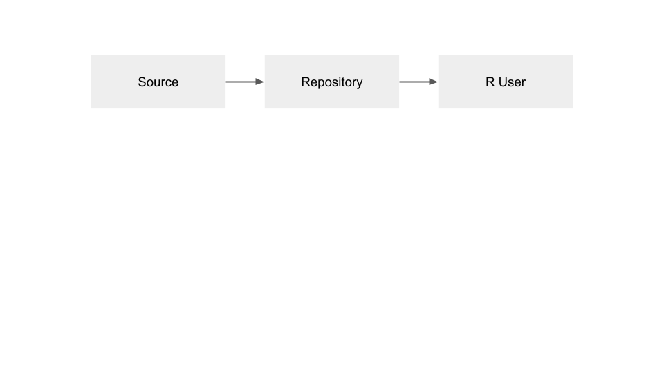
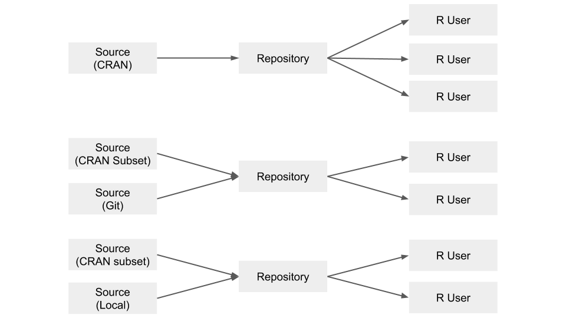
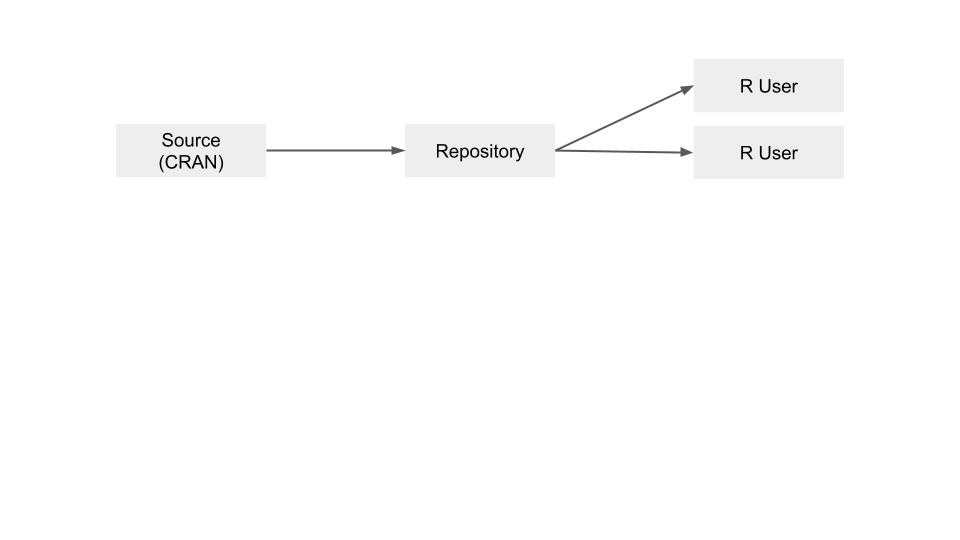
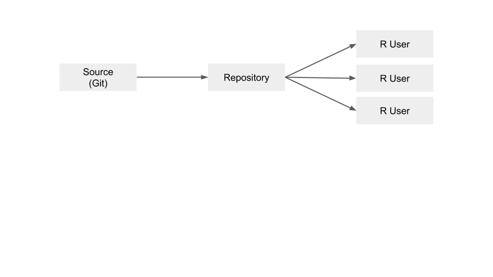

## Session overview

In this session, you will:

* Learn about different package sources and repositories available in RSPM
* Configure different sources in RSPM
* Configure multiple repositories in RSPM

---

## Course outline

Workflow for using RStudio Package Manager:

* Administrator installs RSPM on a server
* Administrator performs configuration on RSPM server
* **Administrator creates sources and repositories**
* End users connect to repositories and download packages

In this module:

* Administering RSPM via the CLI and web interface
* Different types of sources in RSPM
* Repository configurations in RSPM

---

## Administering RSPM

---

### Administering RSPM

From the CLI, you can:

* Initiate CRAN metadata sync
* Add sources and repositories
* Configure different methods of serving packages
* Configure server settings

From the web interface, you can:

* Verify and view repositories
* Explore package details and dependencies
* View package usage
* Inform users on how to get packages from RSPM

---

## Different types of sources in RSPM

---

### Single source and single repository

Package sources can be one of the following types:

* `cran`, `curated cran`, `local`, `git`

Package repositories use a database and specialized web server to handle HTTP
requests from R and serve a source package, archived source package, or
`PACKAGES` file.

More details on repositories and sources are provided in the documentation on
[Repositories and Sources](https://docs.rstudio.com/rspm/admin/repositories.html).

---

### Multiple sources and single repository

* The order of source subscriptions is important and determines the precedence in
which packages will be served

* The order of sources within a repository can be changed using the
`rspm reorder` command.

* For repositories with multiple sources, RSPM will show which source a package
came from.

---

### Multiple sources and multiple repositories

---

### Configuring sources

Configuration quickstarts:

* Serving **CRAN Packages**
* Serving **Local Packages**
* Serving **Local Packages from Git**
* Serving CRAN and Local Packages
* Supplementing CRAN with Bleeding Edge Packages from GitHub
* Serving an **Approved Subset of CRAN**
* Serving an Approved Subset of CRAN and Local Packages

All of these configuration scenarios are described in the documentation on
[Get Started - Configuration](https://docs.rstudio.com/rspm/admin/quickstarts.html).

---

## Repository configurations in RSPM

---

### Serving CRAN packages

* A common use case for RStudio Package Manager is making CRAN packages available
in environments with restricted internet access and tracking package usage
statistics.

* The CRAN source is included as an internal source by default.

* The sync mode is configured to `lazy` downloads by default, but the
`CRAN.SyncMode` property the RSPM configuration file and can be set to `eager`
downloads for eager package fetching.

* The CRAN source is updated according to a the `CRAN.SyncSchedule` property. By
default, RSPM will sync once a day at midnight (in the server’s timezone).

---

### Serving a subset of CRAN packages

* A curated CRAN source enables administrators to give access to an approved list
of CRAN packages using change management to preview changes, add new packages,
and run updates.

* The required dependencies for the specified packages are automatically
discovered and included in the repository.

---

### Serving local packages

* Many teams have a handful of internally built packages.

    * You can create a bundled version of each package and copy the resulting package files to the RStudio Package Manager server.

* RStudio Package Manager will ensure that the latest version is the default
package version that is available

    * But will keep older versions available in the repository's archive for users who want to use specific versions.

---

### Serving packages from Git

* Serving packages from a local source requires manual steps to add and update
bundled versions of packages.

* If your organization uses Git to store internal R packages, you can automate
this process using a git source.

* More details on building R packages from Git are provided in the documentation on
[Building R Packages](https://docs.rstudio.com/rspm/admin/building-packages.html).

---

## Your turn

---

### Your turn

Next complete the exercise.

Signs of success:

* You understand the different types of sources and repositories available in RSPM
* Your RSPM instance is configured with repositories and packages from multiple
  sources

