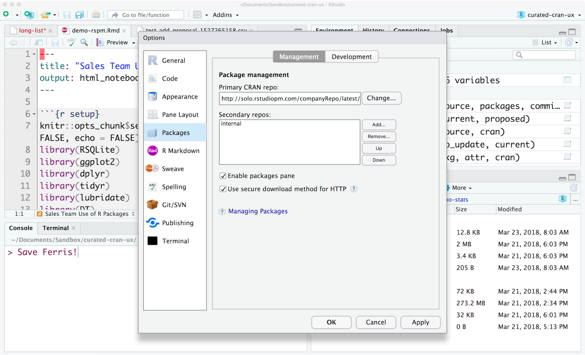
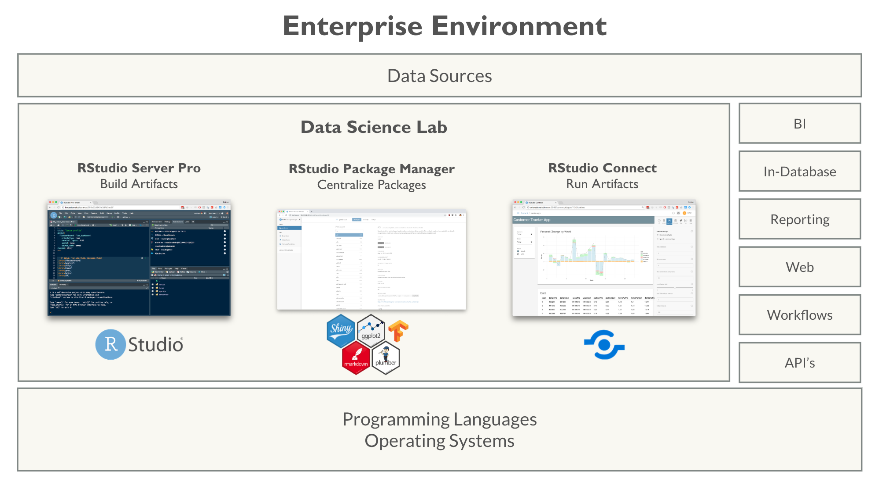
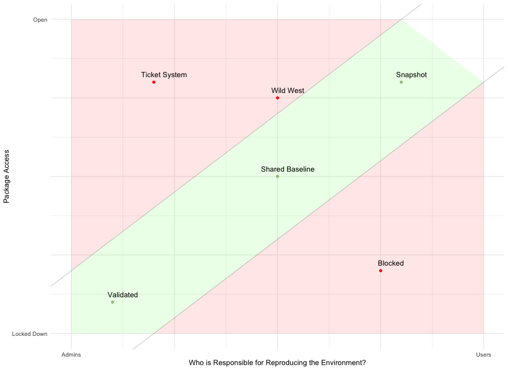

## Session overview

In this session, you will:

* Learn about different methods for configuring package repositories in RStudio
* Configure RStudio Server Pro to point to RSPM package repository


### Course outline

Workflow for using RStudio Package Manager:

* Administrator installs RSPM on a server
* Administrator performs configuration on RSPM server
* Administrator creates sources and repositories
* **End users connect to repositories and download packages**

In this module:

* Administration uses
* End users local config of RStudio IDE / RStudio Server Pro
* Admin global config of RStudio IDE / RStudio Server Pro
* Publishing to RSC


## RSPM for end users


### RSPM for end users

An administrator should work with end users to determine:

* Which RSPM repository they should use
* How they should configure and use repositories in their RStudio environments
* How to find and use the RSPM repository URL(s)
* Whether they want to use latest packages or fixed versions
* Whether they want to use binary or source versions

Repositories in RStudio Package Manager are CRAN-like repositories, which means
users can access and install packages using their regular R functions:

* `install.packages()`
* `available.packages()`
* `packrat` and `renv`
* `devtools::install()`

???

* binaries currently only for Linux
* binary are best when RStudio binary R installation is used
* R 3.6 needs special treetment w.r.t. HTTP headers to make sure that the R version is present


### Connecting to RSPM repositories

Information on connecting to repositories:

* From the RSPM web interface, select a repository
* Navigate to the `Setup` tab
* Follow the steps to configure their RStudio environments with RSPM

Example: Using the latest packages from a repository:

* `http://{RSTUDIO-PM-ADDRESS}/{REPO-NAME}/latest`
* For example, `http://rstudio-pm.company.com/prod-cran/latest`

Example: Using binary packages from a fixed version of a repository:

* `http://{RSTUDIO-PM-ADDRESS}/{REPO-NAME}/__linux__/{LINUX-DIST}/{REPO-VERSION}`
* For example, `http://rstudio-pm.company.com/prod-cran/__linx__/binoic/131`
* `{LINUX-DIST}` is for the distribution on the server running RSP, not RSPM!


### Options for configuring repositories in RStudio

RSPM provides building blocks for configuring repositories and accessing
packages. There are a spectrum of options that range from:

* An administrator assembles all packages and sources into a single
repository, then sets this as only global option in RStudio Server Pro
* An administrator configures multiple sources and repositories, then allows
data scientists to set their own repositories as needed

Repositories can be configured in RStudio in different ways, for example:

* For a single user - Using `options()`
* For a single user - Setting `options()` in `.Rprofile`
* **For a single user - Setting repo(s) in RStudio IDE or RSP (RStudio 1.2+)**
* For all users - Setting repo(s) in `Rprofile.site`
* **For all users - Setting repo(s) in RSP `rsession.conf` globally**


### Configuring RSP 1.1 with RSPM for a single user

Steps for configuring RStudio Server Pro 1.1 with RSPM for a single user using
`.Rprofile`:

A sample `.Rprofile` file with two different package repositories:

```R
local({
  r <- getOption("repos")
  r["CRAN"] <- "https://cran.rstudio.com/"
  r["mycompany"] <- "http://rpackages.mycompany.com/"
  options(repos = r)
})
```

More details on configuring RStudio for different repositories are provided in the documentation on 
[Package management in RStudio Connect](https://support.rstudio.com/hc/en-us/articles/226871467-Package-management-in-RStudio-Connect).

You can also set this globally for all users with `Rprofile.site`.

Or, you can set this for all users in the RStudio Server Pro
configuration file, as shown in one of the following sections.


### Configuring RSP 1.2+ with RSPM for a single user

Steps for configuring RStudio Server Pro 1.2+ with RSPM for a single user:




> In RStudio 1.2 or above, repository settings are configured through the
`Global Options` menu available from the `Tools` section of the main toolbar.
In the `Packages` submenu, copy the repository URL into the "Primary CRAN repo"
field or click `Add` to include this repository as a secondary repo.


### Configuring RSP with RSPM for all users

In the RStudio Server Pro configuration file, `/etc/rstudio/rsession.conf`:

```sh
r-cran-repos=http://{RSTUDIO-PM-ADDRESS}/{REPO-NAME}/latest
```

Or for multiple repositories, use `/etc/rstudio/repos.conf`:

```sh
CRAN=https://<{RSTUDIO-PM-ADDRESS}/{CRAN-REPO-NAME}/latest
Internal=https://{RSTUDIO-PM-ADDRESS}/{INTERNAL-REPO-NAME}/latest
```

You can optionally discourage setting custom repositories in RStudio with the
following setting in `/etc/rstudio/rsession.conf`:

```sh
allow-r-cran-repos-edit=0
```

More details on configuring RStudio Server Pro with RSPM are provided in the
documentation on
[Configuring RStudio Server](https://docs.rstudio.com/rspm/admin/rstudio-server.html).


### Publishing projects to RStudio Connect

If RStudio is configured with RSPM, then RStudio Connect will also retrieve
packages from RSPM when a project is published.




This means that the same versions of packages will be served from a centralized
source (RSPM) whether users are working in development or publishing to
production.


### Using RSPM with Docker for reproducibility

Docker can play an important role in creating reproducible environments, but
Docker alone is not sufficient to guarantee reproducibility.

```docker
RUN Rscript -e 'install.packages(...)'
```

Each time a Docker image is rebuilt, the R command to install packages is
re-run, which can return different package versions and results over time.

Instead, replace the `install.packages(...)` command with a variation that uses
a fixed version of a repository in RStudio Package Manager.

```docker
FROM ubuntu

RUN apt-get install ...

RUN R -e 'install.packages(repos = "https://r-pkgs.example.com/cran/189")'

CMD <some process>
```


## Your turn


## Summary


### RStudio Package Manager summary

RStudio Package Manager allow you to:

* Organize packages in a central repository
* Perform automatic versioning of the entire repository
* Track package usage statistics and metrics
* Integrates with R, RStudio Server Pro, and RStudio Connect
* Serve packages from
    * CRAN
    * Subset of CRAN packages
    * Local packages
    * Packages from Git


### Maintenance plan

* Verify and view repositories
* View package usage statistics
* Review package sync activity
* Explore package details and dependencies
* Inform users on how to get packages from RSPM


### Resources

RSPM Product Information: 

[https://www.rstudio.com/products/package-manager/](https://www.rstudio.com/products/package-manager/)

* Download evaluation
* Two-page Overview
* Architecture video
* Support articles

RSPM Documentation: 

* [https://docs.rstudio.com/rspm/admin/](https://docs.rstudio.com/rspm/admin/)

RSPM Webinar:

* [Introduction to RStudio Package Manager](https://resources.rstudio.com/webinars/introduction-to-the-rstudio-package-manager-sean-lopp)


### Resources (continued)

FAQ:

* [https://docs.rstudio.com/rspm/admin/frequently-asked-questions.html](https://docs.rstudio.com/rspm/admin/frequently-asked-questions.html)

Support FAQ:

* [https://support.rstudio.com/hc/en-us/sections/360001622693-RStudio-Package-Manager](https://support.rstudio.com/hc/en-us/sections/360001622693-RStudio-Package-Manager)

Support Articles:

* [https://support.rstudio.com/hc/en-us/sections/360002093413-RStudio-Package-Manager](https://support.rstudio.com/hc/en-us/sections/360002093413-RStudio-Package-Manager)

Configuration and sizing recommendations:

* [https://support.rstudio.com/hc/en-us/articles/115002344588-Configuration-and-sizing-recommendations](https://support.rstudio.com/hc/en-us/articles/115002344588-Configuration-and-sizing-recommendations)


### Reproducing Environments: Strategies and Danger Zones

* Reproducing data science environments over time can be challenging, c.f. [environments.rstudio.com](https://environments.rstudio.com/)
* RSPM helps to implement different strategies
* Validated:
    - curated CRAN plus local packages
    - fixed snapshot
* Shared Baseline:
    - curated or full CRAN plus local packages
    - fixed snapshot
* Snapshot
    - curated or full CRAN plus local packages
    - snapshots and "latest"





| Label           | Description                                                             | Status |
|-----------------|-------------------------------------------------------------------------|--------|
| Validated       | Admins test and approve a subset of CRAN                                | TRUE   |
| Shared Baseline | 'All or most of CRAN, updated with R versions, tied to a system library | TRUE   |
| Wild West       | Open access, not reproducible, how we learn                             | FALSE  |
| Snapshot        | Open access, user or system records per-project dependencies            | TRUE   |
| Blocked         | Backdoor package access, offline systems without a strategy             | FALSE  |
| Ticket System   | Admins involved, no testing, slow updates, high risk of breakage        | FALSE  |


## Your turn


### Your turn

Next complete the exercise.

Signs of success:

* You understand the different methods of configuring RStudio to access packages from different repositories
* You have RStudio Server Pro configured to obtain packages from RSPM
