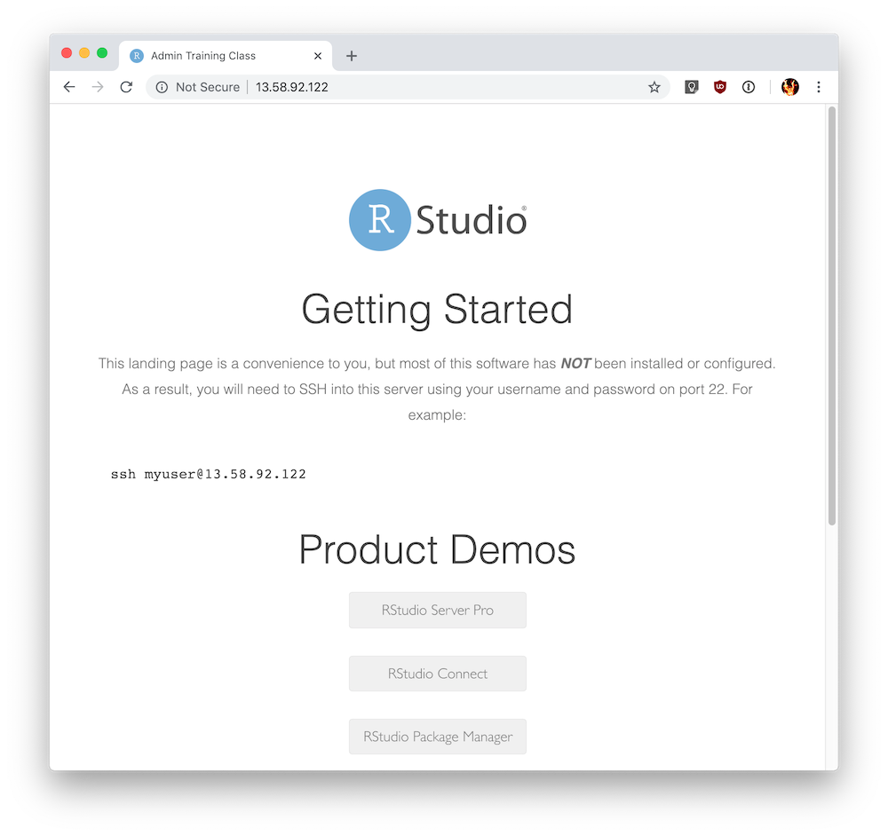

## Overview

In this exercise, you:

* Install RStudio Package Manager
* Test the installation
* Run diagnostics

Refer to the 
[RSPM Documentation](https://docs.rstudio.com/rspm/admin/) 
throughout the exercises, specifically the 
[Getting Started - Installation](https://docs.rstudio.com/rspm/admin/getting-started.html) 
section.


## Quiz: System requirements

Refer to the RStudio Package Manager documentation on [installation pre-requisites](https://docs.rstudio.com/rspm/admin/getting-started.html#prerequisites), then answer the following
questions:

### Supported operating systems

!!! question "What operating systems are supported for RStudio Package Manager?"
    
    * Windows Server 2018
    * SUSE Linux
    * Ubuntu Linux
    * Debian Linux
    * Fedora Linux
    * Red Hat Linux
    * CentOS Linux

    
??? example "Answer:"

    The correct operating systems are: Suse Linux, Ubuntu Linux, Red Hat Linux and CentOS


### R requirements and version

!!! question "What are the requirements for an installed version of R?"
    
    * A - RSPM will not serve packages without a valid installation of R
    * B - RSPM requires a valid installation of R to build R packages from Git
    * C - RSPM requires the same version of R to be installed to match the version of the end users
    

??? example "Answer:"

    B - RSPM requires a valid installation of R to build R packages from Git


!!! question "What is the minimum R version that is supported on RSPM?"
    
    * R-3.0.0
    * R-3.1.0
    * R-3.2.0
    * R-3.3.0
    * R-3.4.0
    * R-3.5.0


??? example "Answer:"

    R-3.0.0


## Quiz: Server instance

### Operating system

Before you start the installation on the server, you should note the operating
system that you are using.

Hint: Run the following command on your server instance:

```sh
lsb_release -a
```

!!! question "What operating system are you using on the training server?"

    * Ubuntu Linux 18.04
    * Red Hat Enterprise Linux 7.5
    * SUSE Linux Enterprise 12


??? example "Answer:"

    The training server is using Ubuntu Linux.


## Task: Install RStudio Package Manager

Perform the following tasks on your course instance:

* Navigate to the  [RStudio Package Manager download page](https://www.rstudio.com/products/package-manager/download-commercial/)
* On your server instance, follow the documented steps to install RStudio Package Manager:
    * Install the required dependency
    * Download the RStudio Package Manager installer
    * Install RStudio Package Manager

In the following exercise, you will test RSPM and ensure that it is installed
correctly.

## Task: Test the RSPM installation

How to know that RSPM installed successfully?

1. Check the status of the RSPM service:

```sh
sudo systemctl status rstudio-pm
```

2. Test the connection to the RSPM web interface by running the following command from your server instance:

```sh
curl localhost:4242/client/
```

!!! note "Note:"
    This is helpful to verify prior to the following step in the event that you have network connectivity or firewall issues.

3. Connect to the RSPM web interface in your browser by visiting the following URL:

```sh
http://{IP-ADDRESS}:4242
```
    
!!! note "Note"
    You can connect to RSPM using the IP address or DNS name.

Note: There are no repositories configured by default, so it is normal to see a message that states there are `No Repos Defined`.
    


4. We've also configured an optional proxy / landing page, which you can connect
in your browser by visiting the following URL:

```sh
http://{IP-ADDRESS}
```
    
Then, to view the RSPM web interface, click on the `RStudio Package Manager`
link, or visit `http://{IP-ADDRESS}/packages/` directly.


