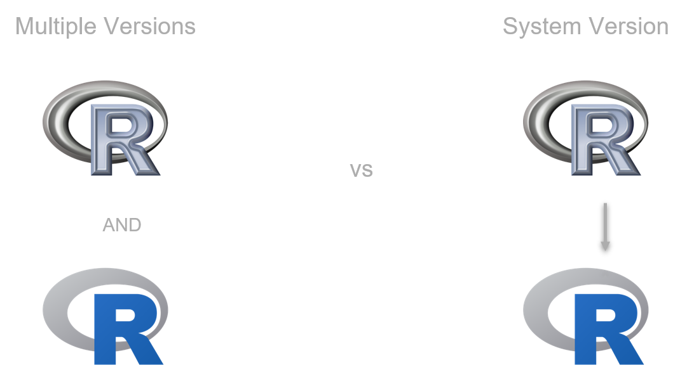

# Installing RStudio Server Pro

You have already installed R from pre-compiled binaries.  In this session you:

* Review the RStudio Server Pro installation checklist
* Install RStudio Server Pro 
* Discuss architecture and some best practices

## Requirements

### Configuration and sizing

The support article [Configuration and sizing recommendations](https://support.rstudio.com/hc/en-us/articles/115002344588-Configuration-and-sizing-recommendations) provides some guidelines on recommended server sizes.

The answer is it depends, but as a general guideline:

Product                 | Minimum (CPU / Memory) | Recommended (CPU / Memory) |
---------------------   |            ----------- |                  --------- |
RStudio Server Pro      |            2 core / 4G |    4 - 16 core / 8G - 256G |
RStudio Connect         |            2 core / 4G |   8 - 16 core / 32G - 128G |
Shiny Server Pro        |            2 core / 4G |      4 - 8 core / 4G - 64G |
RStudio Package Manager | 2 core / 2G (RAM) / 50 G (Disk) | 2 core / 2 G (RAM) / 200 G (Disk) |

### Pre-requirements

To install RStudio Server Pro you need:

* **Root privileges** for installing and running
* Access to the **R programming language** (we recommend [installing from pre-compiled binaries](https://docs.rstudio.com/resources/install-r/))
* Access to an R **package repository**, e.g. [CRAN](https://cran.r-project.org/)
* Configuration for a **user authentication scheme**, e.g LDAP or PAM

Support article:

* [General product requirements](https://support.rstudio.com/hc/en-us/articles/360015177453-RStudio-professional-product-requirements)

## Installation checklist

Please read the support article:

* [RStudio Server Pro Installation and Configuration - Example Checklist](https://support.rstudio.com/hc/en-us/articles/360015079054-RStudio-Server-Pro-Installation-and-Configuration-Example-Checklist)

You can also refer to the [Requirements](https://docs.rstudio.com/requirements/) section of the [RStudio product documentation](https://docs.rstudio.com).

## Installing R :fontawesome-brands-r-project:

:fontawesome-brands-r-project:
:fontawesome-solid-laptop-code:
:fontawesome-regular-laugh-wink:

!!! note 
    You have already installed R in the previous exercise, but it's worth repeating the point.
    We strongly recommend you **install R from pre-compiled binaries** to get **multiple R versions side-by-side**

Why?

* [Building Additional Versions from Source](https://docs.rstudio.com/ide/server-pro/r-versions.html#installing-multiple-versions-of-r)
* RStudio recommends keeping multiple versions for a *deploy-and-forget* mindset (or at least less *line-in-the-sand* upgrade scenarios)

## Your turn

Next complete the exercise.

Signs of success:

* You have installed RStudio Server Pro
* RStudio Server Pro is running
