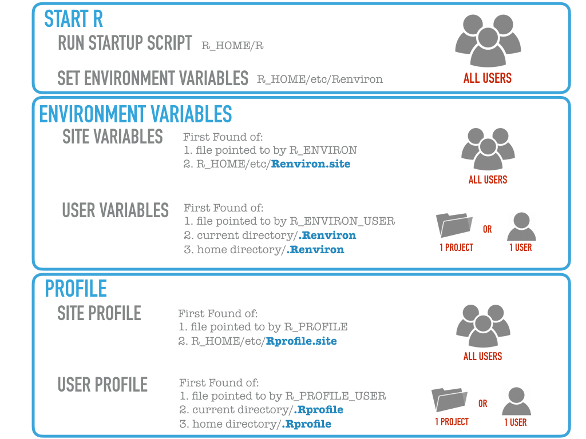

## Objectives

In this session you:

* Review the R startup sequence and how the admin can modify this
* How to use RStudio Package Manager for fast package install from binaries

## Understanding the R startup sequence

### How R starts up

As the R admin or system administrator for the R environment, you should understand the startup sequence of R.

* Run startup script
* Create environment variables in `Renviron`
* Run `Rprofile` script 

For a very good introduction, read the RViews article [R for Enterprise: Understanding R’s Startup](https://rviews.rstudio.com/2017/04/19/r-for-enterprise-understanding-r-s-startup/)

## Installing binary packages

### Introduction to RStudio Package Manager

You will cover RStudio Package Manager later in this course, but for now it's sufficient to know that you can use Package manager to:

* Create and host an internal mirror of the CRAN package repository
* Host package manager in an air-gapped environment, i.e. a server with no external internet access
* Augment the CRAN packages with additional packages from a git source, e.g. Github, GitLab or your own private git server
* Add private packages

In addition, RStudio Package Manager can serve binary versions of these packages, meaning your users don't have to install all packages from source.

### Installing binary packages from RStudio Package Manager

Now is a good time to introduce one powerful benefit of package manager:

* You can serve binary versions of R packages using RStudio Package Manager
* This has a substantial performance benefit for users, since they don't have to compile all packages from source

You can read the announcement of binary packages at the RStudio blog: [Package Manager 1.1.0 - No Interruptions](https://blog.rstudio.com/2019/11/07/package-manager-v1-1-no-interruptions/)

!!! note "Note"
    You don't need to install RStudio Package Manager yourself to benefit from this feature.
    Instead, you can use the [RStudio hosted Package Manager instance](https://packagemanager.rstudio.com) for installation.  
    This is the main objective of the exercise for this section.

## Your turn

Next complete the exercise.

Signs of success:

* You have configured RStudio Server to install binaries from the RStudio demo instance of Package Manager
* You have installed some packages and observed that there is no compilation step.
