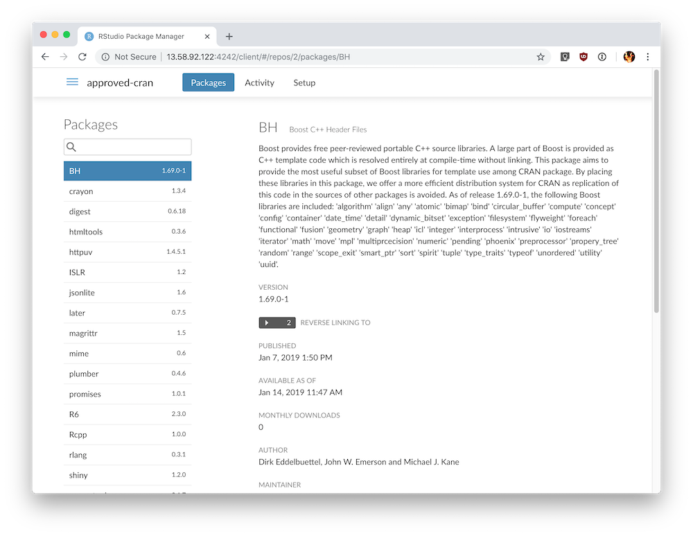
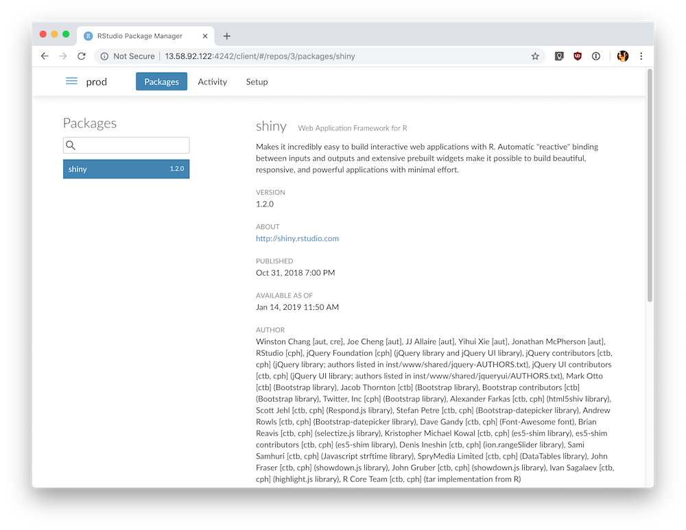

## Overview

In the following exercises, you will:

* Add new repositories and sources for:
    * Serving packages from CRAN
    * Serving packages from curated CRAN
    * Serving packages from Git

Refer to the  [RSPM Documentation](https://docs.rstudio.com/rspm/admin/) throughout the exercises, specifically the [Getting Started: Configuration](https://docs.rstudio.com/rspm/admin/quickstarts.html) section.


## Task: Add a CRAN repository

Follow the documented steps for [Serving CRAN Packages](https://docs.rstudio.com/rspm/admin/quickstarts.html#quickstart-cran) to add a new repository that is subscribed to the CRAN source.

The steps you will perform are outlined as follows:

* Initiate a sync from the default CRAN source
* Create a new repository
* Subscribe the new repository to the default CRAN source

You can verify that the new repository has been configured correctly by running:

```sh
rspm list
```

Which should include the following output:

```sh
prod-cran - Access CRAN packages
 - cran (CRAN)
```

## Task: Explore CRAN repository

Navigate to the RSPM web interface in your browser and view the newly created `prod-cran` repository.


Search for the `ggplot2` package and determine the following:

* The newest version of the package that is available
* The oldest version of the package that is available
* The license type for this package
* The command that R users can use to install the latest version of `ggplot2`
* The command that R users can use to install version 2.2.0 of `ggplot2`
* How many packages are imported and suggested by `ggplot2`

## Quiz: CRAN source

!!! question "Which CRAN source does RStudio Package Manager download packages from?"
    
    * The CRAN mirror closest to my location
    * Any available CRAN mirror
    * The RStudio CRAN service (https://rspm-sync.rstudio.com)
    * RSPM does not download packages from online sources

    
??? example "Answer:"

    The RStudio CRAN service (https://rspm-sync.rstudio.com)


!!! question "Is RStudio package manager configured for lazy or eager package downloading by default?"
    
    * Lazy - RSPM only downloads packages as they are requested
    * Eager - RSPM downloads all packages in advance


??? example "Answer:"

    Lazy - RSPM only downloads packages as they are requested


!!! question "How often does RStudio Package Manager synchronize CRAN metadata by default?"
    
    * Never
    * Once every hour
    * Once every day at midnight
    * Once every week on Sunday
    * On the first day of each month
    * Once every year on Jan 1


??? example "Answer:"

    Once every day at midnight


## Task: Add a curated CRAN repository

Follow the documented steps for 
[Serving a Subset of Approved CRAN Packages](https://docs.rstudio.com/rspm/admin/quickstarts.html#quickstart-curated-cran) 
to add a new repository that is subscribed to a source of approved CRAN packages.

Hint: You can also pass in the names of packages directly instead of creating a
list of packages, as in:

This will do a dry-run of the package installation and print a transaction ID.

```sh
rspm add --packages 'plumber,shiny,ISLR' --source=subset
```

The transaction ID printed above is used to then apply the command with the flag `--transaction-id`.

```
rspm add --packages 'plumber,shiny,ISLR' --source=subset --transaction-id=<TRANSACTION-ID>
```

The steps you will perform are outlined as follows:

* Create a list of packages
* Initiate a sync from the default CRAN source
* Create a new source for the approved packages
* Add the desired packages to the curated CRAN source
* View the list of proposed packages that will be added to the newly created source
* Add the proposed packages to the newly created source
* Create a new repository for the approved packages
* Subscribe the new repository to the default CRAN source

You can verify that the new repository has been configured correctly by running:

```sh
rspm list
```

Which should include the following output:

```sh
approved-cran - Approved packages from CRAN
 - subset (Curated CRAN)
```

Navigate to the RSPM web interface in your browser and explore the newly created
`approved-cran` repository.



## Quiz: Curated CRAN source

!!! question "How does RSPM handle dependencies for curated CRAN sources?"

    * RSPM only downloads the packages that are explicitly listed without considering dependencies
    * RSPM automatically resolves the dependencies for listed packages and includes them
    * RSPM requires you to iterate and separately add each dependency to the package list


??? example "Answer:"

    RSPM automatically resolves the dependencies for listed packages and includes them


!!! question "How do you add new packages to a curated CRAN repository?"

    * You must create a new repository each time you want to add a new package
    * You must create a new source each time you want to add a new package
    * You can add new packages to a curated CRAN source at any time


??? example "Answer:"

    You can add new packages to a curated CRAN source at any time
    

!!! question "How often are updated packages made available in a curated CRAN repository?"

    * Each time the `rspm update` command is manually run
    * Once every day at midnight
    * On the same schedule as the CRAN metadata sync


??? example "Answer:"

    Each time the `rspm update` command is manually run
    


!!! question "Can you update a single package in a curated CRAN repository without updating the dependencies?"

    * Yes, you can specify a single package to update without affecting the dependencies
    * No, RSPM will always resolve dependencies for all specified packages to avoid an invalid repository state


??? example "Answer:"

    No, RSPM will always resolve dependencies for all specified packages to avoid an invalid repository state


## Task: Add a Git repository

Follow the documented steps for 
[Serving Local Packages from Git](https://docs.rstudio.com/rspm/admin/quickstarts.html#quickstart-git)
to add a new repository that is subscribed to a source with packages from Git.

Hint: You'll need to configure the 
[version of R](https://docs.rstudio.com/rspm/admin/building-packages.html#r-configuration)
using the `Server.RVersion` option in the config file and then 
[restart RSPM](https://docs.rstudio.com/rspm/admin/getting-started.html#restart-rstudio-package-manager).

Hint: Use the Git URL `https://github.com/rstudio/shiny.git` in the `--git-url`
option in the `rspm add` command.

The steps you will perform are outlined as follows:

* Create a new source for the packages from Git
* Add a Git endpoint to the newly created source
* Create a new repository for the packages from Git
* Subscribe the new repository to the Git-based source

You can verify that the new repository has been configured correctly by running
the following command:

```sh
rspm list
```

Which should include the following output:

```sh
prod - Stable releases of our internal packages
 - prod-internal-src (Git)
```

And you can verify the Git builder by running the following command:

```sh
rspm list git-builders
```

Which should include the following output:

```sh
Git Builders:
- shiny
    Source: prod-internal-src
    URL: https://github.com/rstudio/shiny.git
    Trigger: tags
    Key: none
```

Navigate to the RSPM web interface in your browser and explore the newly created
`prod` repository.

After a few minutes, you should see the latest tagged release build of `shiny`
in your `prod` repository.



## Quiz: Git source

!!! question "How can you configure the frequency at which RSPM checks Git repositories for package changes?"

    * By creating a cron job to check new Git commits
    * By configuring your CI/CD system to poll RSPM
    * By configuring the `Git.PollInterval` setting in the RSPM configuration options

??? example "Answer:"

    By configuring the `Git.PollInterval` setting in the RSPM configuration options

