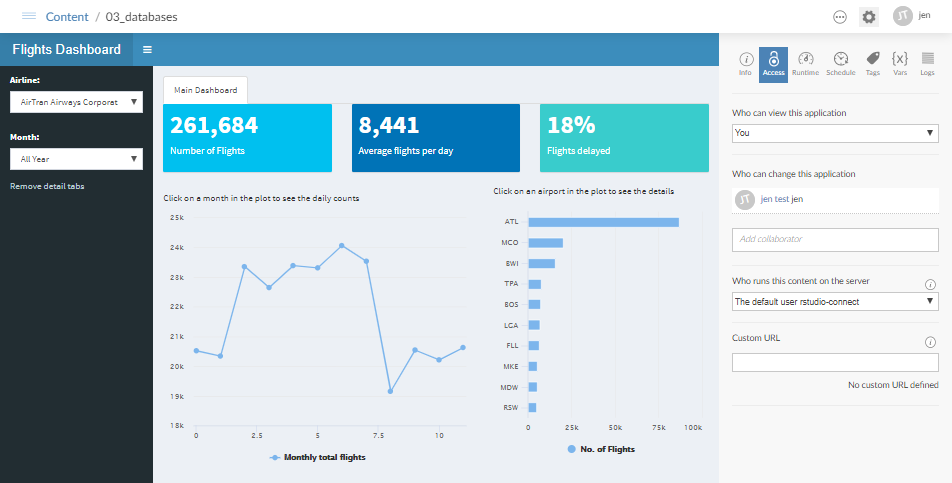
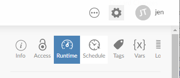
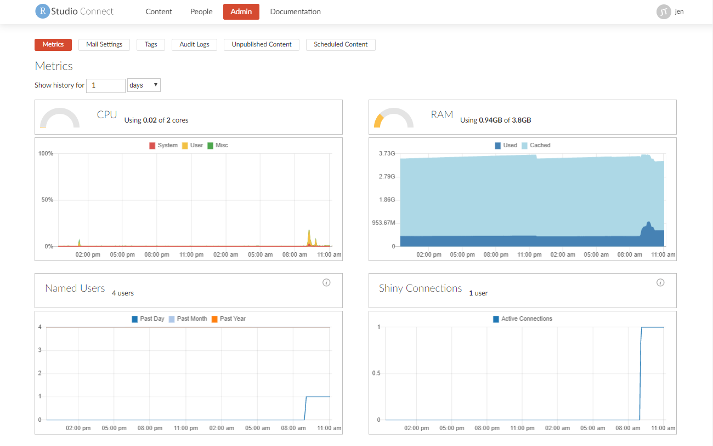
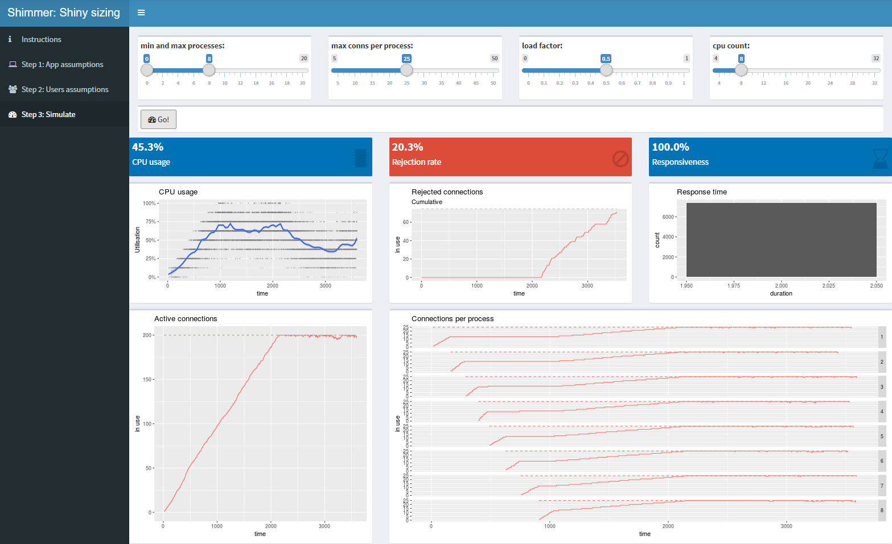

## Task: Explore the Connections pane

The app `03_databse/app.R` is a Shiny application that reads data from a PostGres database.

The RStudio IDE has a pane for "Connections" that allows you to establish database connections and browse information contained in the database tables.

See these support articles:

* [Using RStudio Connections](https://support.rstudio.com/hc/en-us/articles/115010915687-Using-RStudio-Connections)
* [Troubleshooting Connections](https://support.rstudio.com/hc/en-us/articles/115011264307-Troubleshooting-Connections)

As well as the article at [db.rstudio.com/](https://db.rstudio.com/)

* [RStudio Connections Pane](https://db.rstudio.com/rstudio/connections/)


And you can watch this video walkthrough:

<video height="400px"controls>
  <source src="https://cdn.rstudio.com/pro-admin/videos/new_db_connection.mp4" type="video/mp4">
</video>


## Task: Deploy a Shiny app with database connection

Run the app `03_database/app.R` in the IDE to make sure everything works.



Notice that the connection gets established by this line of R code:

```r
con <- DBI::dbConnect(odbc::odbc(), "Postgres Dev")
```

Deploy `03_database/app.R` to Connect (using the publish button in the Source pane).

While you wait, can you figure out how "PostGres Dev" is defined?

Hint:

```sh
cat /etc/odbc.ini 
cat /etc/odbcinst.ini
```


## Task: Change runtime settings

While you're viewing the deployed app in Connect, find the "runtime settings":





The Connect admin guide explains these settings at:

* [Applications & APIs](https://docs.rstudio.com/connect/admin/process-management/#applications-and-apis)
* [Runtime/Scheduler](https://docs.rstudio.com/connect/admin/appendix/configuration/#Scheduler)


Read this part of the admin guide, then change the settings to allow parallel execution of your app:

Setting                     | New value
:-------------------------- | ---------:
Max processes               | 6
Min processes               | 1
Max connections per process | 2
Load Factor                 | 0.1

The setting pane looks like this:


## Task: Load the app

* Open the metrics dashboard in a new browser tab
   * As an administrator, you can find the "metrics" as a pane in the admin dashboard:




Return to your app, and progressively open the app in 6 new tabs

* Do this by pasting the app URL in 6 new browser tabs
* Each new tab will establish a new connetion to your app.
  

Notice in this recording how the CPU indicator goes into the red very quickly, as each shiny connection puts a new demand on the database.  However, even a 2CPU machine can handle the 6 simultaneous connections, albeit with some delay to the user:


<video height="400px"controls>
  <source src="https://cdn.rstudio.com/pro-admin/videos/load_shiny_app.mp4" type="video/mp4">
</video>


## Simulation: shimmer

Open the `Shimmer and shiny` simulation app at [https://colorado.rstudio.com/rsc/shimmer_and_shiny/](https://colorado.rstudio.com/rsc/shimmer_and_shiny/)

* Read the instructions
* Perform the simulation
* Adjust setting until all the measurements are in the "blue"




Try to develop an intuitive understanding of the runtime settings.

Ideas to try:

* Increase the number of users
* Increase the number of requests per user
* Increase the app response time

Then modify the server size and runtime settings until all the indicators are in the "blue"

